# kaleidotron

A fast, **pixel-art-first** media **browser** for Linux/macOS/Windows, written in
Rust with [egui/eframe](https://github.com/emilk/egui).

It started as an image viewer. It now also converts images to ANSI/PETSCII/ASCII art,
renders 3D models, plays and trims video, edits samples and MIDI drum kits, browses
a dozen web sources, and edits text — hence the name.

## From Pixel Viewer to Kaleidotron

*It started as **Pixel Viewer** — a fast pixel-art image viewer (a decoder registry, a
thumbnail grid, and a nearest-neighbor zoom view). Here's everything that grew on the way
to the new name:*

- **Format coverage exploded** — from a handful of raster types to **40+ formats**:
  palette-preserving PCX / IFF-ILBM / BSAVE, Aseprite, PSD, GIMP XCF, SVG, and the whole
  textmode/scene family (ANSI, XBin, TundraDraw, iCE Draw, Artworx, PETSCII, petmate, RIPscript)
- **It converts, not just views** — a full **image → ANSI / ASCII / Unicode / PETSCII /
  ATASCII / Apple ][ / REXPaint** art pipeline, exportable back to `.ans` / `.xb` / `.petmate` / …
- **A non-destructive Recolor stack** — reorderable adjustments, dithering
  (Bayer / custom / Floyd–Steinberg / Atkinson), palette remap + reduce-to-N, pixel-art
  upscalers (xBR / HQx / Scale2x / 2xSaI), CRT post-FX — saved as reusable **PixelFX presets**
  (83 bundled)
- **Grew a sampler + DAW corner** — waveform editor, a **16-pad Battery-style sampler** with
  ADSR/MSEG envelopes, LFOs, filters, MIDI-learn, hardware MIDI in, kit save/load, native SFZ
  export; plays trackers (MOD/XM/S3M/IT/…), MIDI (SoundFont), and RAD (OPL3 FM)
- **Plays & edits video** — ffmpeg-backed player with A/V sync, hover-scrub thumbnails,
  **lossless trim & join**, and YouTube-compatible `.md` chapter markers
- **Renders 3D** — obj/stl/ply/gltf/glb/dae via a CPU rasterizer, interactive orbit + FPS
  free-fly viewer, PNG export
- **Reads code, PDFs, mind maps** — ~90 syntax-highlighted languages (VS Code theme import),
  real PDF page renders, `.xmind` with the file's own theme
- **Twelve web sources** — 16colo.rs, Poly Haven, Google Fonts, Lospec (palettes + gallery),
  The Mod Archive, Openverse, Iconify, Wikimedia, a URL "HTTP browser," YouTube, Steam, and DeviantArt
- **Became a real browser** — VS Code-shaped UI (activity rail, command palette, quick open),
  recursive advanced search with saved filters, Grid/Table views, favorites, star ratings
  (Gwenview-compatible), view history, git status, side-by-side image compare with layered-PSD export
- **Authentic scene tooling** — SAUCE-aware rendering, true 24-bit ANSI, 9-dot VGA cells,
  baud-rate "watch it draw" ANSImation/RIP playback, CRT phosphor/scanlines, a random-pack
  screensaver, and **run DOS programs in DOSBox**
- **Cross-platform** — Linux/macOS/Windows, headless `--render` batch conversion, and it still
  opens instantly and zooms pixel-perfect like the original viewer did

> I wrote this to accompany my https://github.com/grymmjack/pixelmon so I could easily see my generated AI art and rate it fast.
> Needless to say, things got a little...


It decodes everything from PNG and Photoshop files to Commodore PETSCII and EGA
vector RIPscript, browses inside archives (`.zip`/`.lha`/`.arj`/…), and can mount
[16colo.rs](https://16colo.rs) — the online ANSI archive — as a virtual folder.


Think *Gwenview for pixel art and the BBS scene*: crisp nearest-neighbor zoom, palette-preserving decoders,
a virtualized thumbnail grid, and first-class support for ANSI / PETSCII / RIPscript
and the rest of the demoscene / textmode art world — right down to baud-rate
"watch it type" playback and CRT effects.

### A few screens

| | |
|---|---|
| 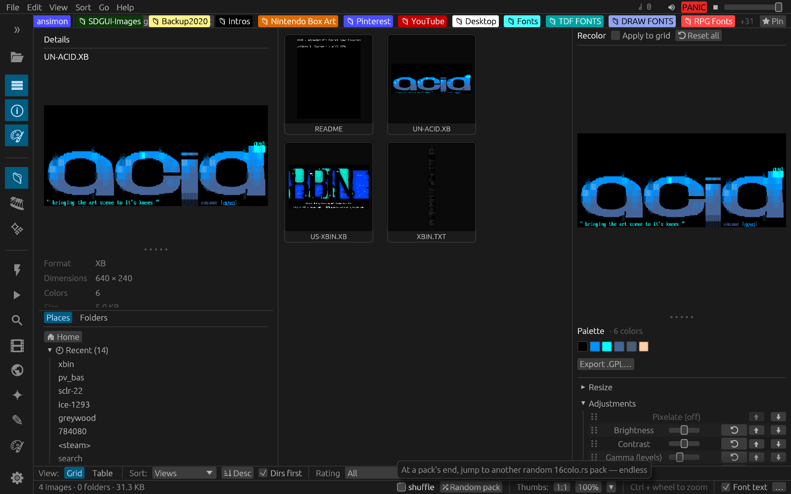 **Thumbnail grid** — virtualized, independently zoomable, with a live details dock | 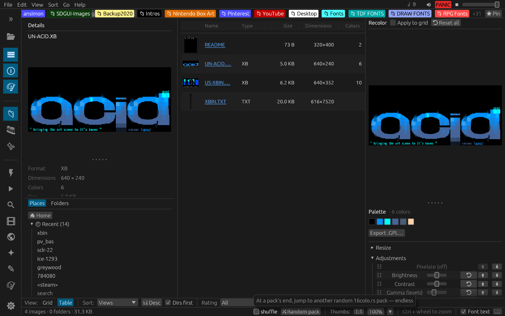 **Table view** — sortable, resizable, reorderable columns |
| 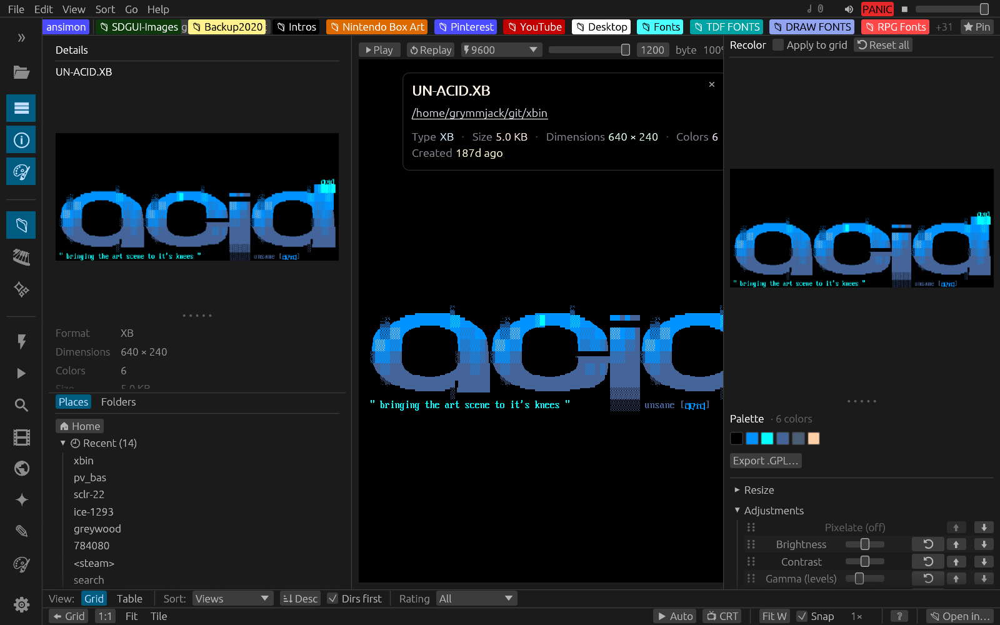 **Viewer** — pixel-perfect scene art, metadata OSD, baud-rate playback | 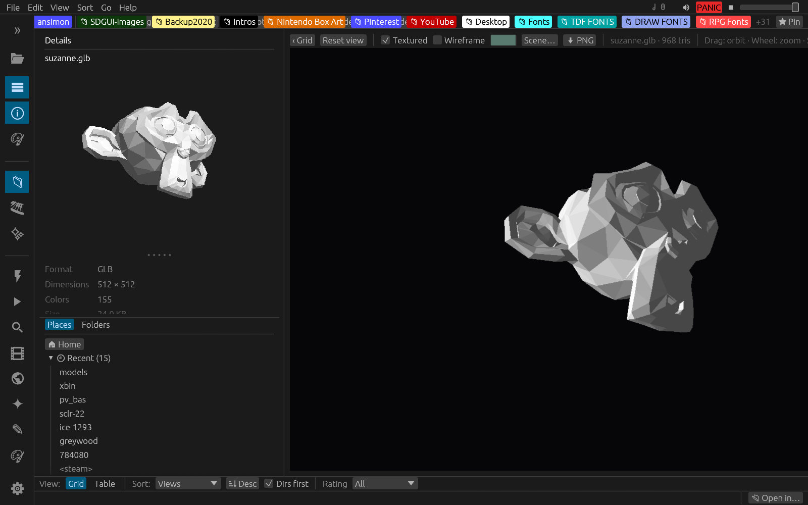 **3D viewer** — CPU-rasterized, orbit or FPS free-fly |
| 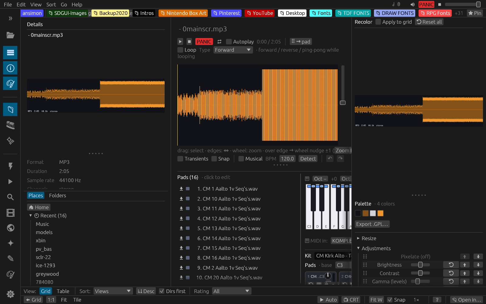 **Sampler** — waveform editor, 16 pads, MIDI in | 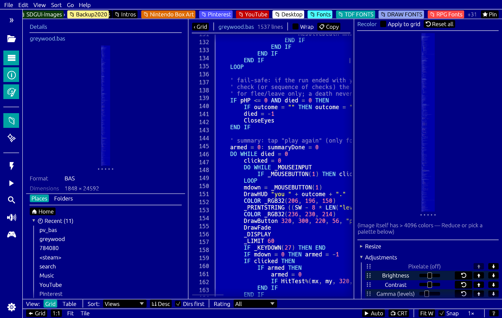 **Text viewer** — real syntax highlighting, VS Code themes |

---

## Table of contents

- [Highlights](#highlights)
- [Complete feature list](#complete-feature-list)
- [Supported formats](#supported-formats)
- [Install & build](#install--build)
- [Quick start](#quick-start)
- [Feature tour](#feature-tour)
  - [Browsing & navigation](#browsing--navigation)
  - [The thumbnail grid](#the-thumbnail-grid)
  - [The single-image viewer](#the-single-image-viewer)
  - [Pixel-perfect rendering](#pixel-perfect-rendering)
  - [Recolor / colorizer pane](#recolor--colorizer-pane)
  - [Crop tool](#crop-tool)
  - [Image → text-art converters](#image--text-art-converters)
  - [Palettes](#palettes)
  - [Star ratings](#star-ratings)
  - [Search & smart filters](#search--smart-filters)
  - [File operations](#file-operations)
  - [Open in… (external program associations)](#open-in-external-program-associations)
  - [Source code, PDF & audio (plugins)](#source-code-pdf--audio-plugins)
  - [Archives & 16colo.rs](#archives--16colors)
  - [Scene art, ANSImation & retro effects](#scene-art-ansimation--retro-effects)
  - [Animated GIFs](#animated-gifs)
  - [Text viewing & editing](#text-viewing--editing)
  - [3D models](#3d-models)
  - [Video](#video)
  - [Image compare](#image-compare)
  - [Mind maps (XMind)](#mind-maps-xmind)
  - [Fonts & type](#fonts--type)
  - [AI generation](#ai-generation-plugin)
  - [Git status](#git-status)
- [The interface](#the-interface)
  - [Activity rail & docks](#activity-rail--docks)
  - [Command palette & quick open](#command-palette--quick-open)
  - [Themes (and VS Code theme import)](#themes-and-vs-code-theme-import)
  - [Configuration files](#configuration-files)
- [Web sources](#web-sources)
- [Keyboard shortcuts](#keyboard-shortcuts)
- [Command-line options](#command-line-options)
  - [Rendering text art to files](#rendering-text-art-to-files---render)
- [Menu reference](#menu-reference)
- [Settings & where things are stored](#settings--where-things-are-stored)
- [Bundled palettes](#bundled-palettes)
- [Architecture](#architecture)
- [Development](#development)
- [Credits](#credits)
- [License](#license)

---

## Highlights

- **40+ image & scene-art formats**, including palette-preserving PCX, IFF/ILBM,
  BSAVE, Aseprite, PSD, GIMP XCF, SVG, and the full demoscene/textmode set (ANSI, XBin,
  PETSCII, RIPscript, and more).
- **Pixel-perfect zoom** — nearest-neighbor textures, snapped to whole device
  pixels so dithering never warps, even on fractionally-scaled (HiDPI) displays.
- **Virtualized thumbnail grid** — *or a sortable table view* — that scrolls smoothly
  through folders of thousands of images, with independent Ctrl+wheel tile sizing and
  configurable captions.
- **Recolor pane** — a fully reorderable pipeline: adjustments
  (brightness/contrast/gamma/hue/vibrance/posterize/invert/…), per-axis **pixelate**,
  palette rematch, **reduce-to-N** (on any image), **dithering** (with a zoomable,
  per-axis cell + Auto-detect), **resize/resample** with **pixel-art upscalers**
  (Scale2x/3x, Eagle, xBR, HQx, 2xSaI…), and bakeable **CRT post-FX**
  (scanlines / glow / vignette / phosphor). Save the whole stack as a named
  **PixelFX preset** and re-apply it in one click — and it all works on 16colo.rs art too.
- **A library of 55 bundled palettes** (CGA, EGA, VGA, Game Boy, NES, C64, PICO-8,
  DawnBringer, Endesga, …) plus `.GPL` import/export.
- **Beyond images** — view **source code** (~90 languages, syntax-highlighted), **PDFs**
  (real rendered pages + a 1-/2-page viewer), and **audio** (an in-app waveform player with
  looping, a piano-key sampler playable from a **hardware MIDI controller**, tracker-module
  playback with a per-sample explorer/export, and **sample banks — SoundFont / SFZ / DLS —
  browsed as a folder** of their samples). Each is a **toggleable plugin** you can switch off in
  Preferences.
- **3D models** (`obj/stl/ply/gltf/glb/dae`) with real thumbnails and an interactive
  viewer — orbit or FPS free-fly, textured/wireframe, light presets, PNG export. Rendered
  on the **CPU**, so the same renderer draws the tile and the viewport.
- **Video** (`mp4/mkv/webm/mov/…` via ffmpeg) — real frame thumbnails, hover-scrub, an
  in-app player with A/V sync, audio-scrubbing seek, **lossless trim and join**, frame
  export, and **chapter markers in a `.md` sidecar** that paste straight into a YouTube
  description.
- **Text editing, opt-in** — source files open in a real, selectable, syntax-highlighted
  text view; an `✎ Edit` button turns on saving, find/replace and `tail -f` follow. Until
  you press it, nothing can overwrite a file.
- **Twelve web sources** — 16colo.rs, Poly Haven, Google Fonts, **Lospec** (palette list
  *and* the art gallery), The Mod Archive, Openverse, Iconify, Wikimedia, plus an **HTTP
  browser** that turns any URL into a browsable tree with wildcard batch download. Also
  YouTube (via yt-dlp), your local Steam library, and **DeviantArt** (the official API).
  All keyless except DeviantArt, which uses free app credentials you paste in once.
- **A VS Code-shaped interface** — activity rail, command palette (`Ctrl+Shift+P`), quick
  open (`Ctrl+P`), per-mode panel layouts, toasts, recents, and four editable config files.
  **Drop a VS Code theme in and it just works**, for the app chrome, the syntax
  highlighting, or both.
- **Side-by-side image compare** with a tolerance/opacity diff overlay and **layered PSD
  export**, so the diff stays editable in Photoshop or GIMP.
- **Star ratings** stored as KDE Baloo xattrs (interoperate with Gwenview), with a
  cross-platform sidecar so even art inside a zip or on 16colo.rs is ratable.
- **A fading metadata OSD** in the viewer — title, artist(s), SAUCE comment and
  attributes — with clickable links that jump to the artist / group / pack on 16colo.rs.
- **View-history tracking** — visited pieces get a browser-style "you've seen this"
  link colour / check badge, plus view count and last-viewed in the Details pane.
- **Recursive advanced search** (name / type / dimensions / size / date / rating /
  SAUCE text) on a background thread, plus saveable "smart filters."
- **Browse archives and the online ANSI scene** as if they were folders — including
  flattening a 16colo.rs **artist / group / search** into a sortable table of individual
  pieces, backed by a persistent on-disk cache.
- **The BBS aesthetic, faithfully**: SAUCE-aware textmode rendering with true 24-bit
  color, authentic IBM VGA & C64 fonts, baud-rate ANSImation/RIP playback, CRT scanlines,
  phosphor glow, 9-dot VGA cells, slideshow, an immersive fullscreen mode, and a
  random-pack screensaver.
- **Old-school DOS formats, first-class**: palette-preserving IFF/ILBM (incl. Deluxe Paint
  PBM, HAM & EHB) and BSAVE CGA / mode-13h screen dumps, plus **content-sniffing** so a
  group's oddball extension (`.hpe`/`.ad`/`.mir`/…) still renders as scene art. And you can
  **run `.com`/`.exe`/`.bat` DOS programs in DOSBox** — period-accurate machine presets,
  pack folder auto-mounted as `C:`.

---

## Complete feature list

Everything the app does, grouped. (The [Feature tour](#feature-tour) below explains the
big ones in prose; this is the exhaustive index.)

**Browsing & navigation**
- Folder navigation with breadcrumbs, back/forward/up history, and a `~` Home jump
- Drag-reorderable **favorites** bar; right-click to remove; per-favorite **color tags**
- Left **activity rail** (VS Code-style) toggling the explorer / details / recolor docks
- **Explorer** dock: lazy expandable folder tree + a live filter box
- **Details** dock: fit thumbnail, palette swatches, `.GPL` export, full metadata, git status, view count
- **Places** dock with sub-tabs: Local · PixelFX · 16colo.rs · Kits · Samples, each with pins
- Filename search (`/`), recursive **advanced search**, and saved **smart filters**
- Recursive folder **montages** + file-count badges on folder tiles

**Thumbnail grid & table**
- Virtualized grid that scrolls smoothly through thousands of files
- Independent **Ctrl+wheel** tile sizing; configurable per-tile captions; optional tile borders
- Sortable / resizable / **reorderable-column** table view (Grid⇄Table toggle, persisted)
- Transparency backdrop (checkerboard or solid) behind transparent thumbnails
- Hover-to-play animated GIFs; hover-scrub video storyboard; DOS / generic / format-badge tiles
- Loading spinners; view-history **check badges**; git-status corner badges + filename tint

**The viewer**
- Nearest-neighbor zoom — device-pixel steps for text-mode art, remembered `%` for raster
- **Fit** (F, sticky/auto) and **Fit-width** modes; navigator minimap; multi-tile huge-image support
- Arrow / Home / End / PageUp-Down scrolling for tall art; Left/Right = prev/next image
- Fading, positionable **metadata OSD** with clickable artist / group / pack links
- **Immersive** fullscreen (F11, auto-hiding chrome + cursor); slideshow; random-pack screensaver

**Pixel-perfect & CRT rendering**
- Integer device-pixel snap + origin grid-snap so dithering never warps on HiDPI
- Authentic IBM VGA CP437 font; **9-dot VGA cell** and **CRT aspect** (~1.2× vertical) toggles
- Baked-or-live CRT effects: **scanlines**, **phosphor glow**, black background

**Recolor / colorizer pipeline** (fully reorderable)
- Adjustments: brightness, contrast, gamma, shadows, highlights, posterize, hue, saturation, **vibrance**, sharpen, **invert**
- **Pixelate** (per-axis W×H + lock), **palette remap**, **reduce-to-N** (works on any image)
- **Dithering**: ordered/Bayer, editable **custom matrix**, error-diffusion (Floyd–Steinberg / Atkinson), per-axis cell + **Auto-detect**
- **Color balance** (per-channel offset), **resize/resample** at reduced resolution
- **Pixel-art upscalers**: Scale2x/3x, Eagle, xBR 2×/3×/4×, HQ2x/3x/4x, 2xSaI / Super2xSaI / SuperEagle
- **CRT post-FX** (bakeable, positionable): scanlines, glow (contour profiles), vignette, phosphor
- **PixelFX presets** — save the whole stack; folders; **83 Factory presets** bundled; applies to 16colo.rs art too

**Crop** — non-destructive & per-image, zoom/pan placement, Thirds/Golden/Grid/Spiral guides, Free/4:3/16:9/16:10 aspect + flip, named presets, optional bake-to-file

**Image → text-art converters** — **ANSI Shade**, **ASCII**, **Unicode** (half-block / Braille / ramp), **PETSCII**, **ATASCII**, **Apple ][**, and **REXPaint font** (45 bundled fonts); a shared drag-select **glyph picker**; exports to `.ans` / `.xb` / `.tnd` / `.xp` / `.petmate` / `.seq` / `.json` / `.txt` / `.png`

**Palettes** — 55 bundled (CGA/EGA/VGA/Game Boy/NES/C64/PICO-8/DawnBringer/Endesga/…), `.GPL` import/export, palette-preserving decoders

**Ratings & history** — KDE Baloo xattr ratings (Gwenview-compatible) + a cross-platform sidecar for virtual art; view-history with visited link colours, count and last-viewed

**Search** — background recursive search on name / type / dimensions / size / date / rating / SAUCE text; saveable smart filters; in-memory filtering of remote listings

**File operations** — copy / cut / paste, new folder, rename, trash + **Ctrl+Z undo**; drag-reorder favorites; pin folders to Places

**External integration**
- **Open in…** per-extension program associations (+ "Other program…"); "Open in default app"
- **`tasks.json` runner** — run a folder's VS Code build/tool tasks (Ctrl+Shift+B), with an output panel
- **DOSBox** — run `.com`/`.exe`/`.bat`/`.cmd`; pack-root mounted as `C:`; keep-open; machine presets (XT → Pentium MMX); SVGA mode; banner/autoexec suppressed; never auto-launched

**Source code & text** (plugin) — ~100 languages syntax-highlighted; Preview-image / View-text / Edit-text / **Open-as-text-art** open modes; find/replace; `tail -f` follow; UTF-8 / CP437 / Latin-1 encodings; CRLF preserved; custom code font + current-line highlight; VS Code theme colours

**PDF** (plugin) — real first-page tiles, in-app 1-/2-page viewer, pseudo-vector re-render on zoom

**Audio** (plugin)
- In-app **waveform player**: loop / seek / region select, playhead, autoplay, spacebar transport
- **Sampler keyboard** (auto-ranging, click-to-audition, pitch via octave keys)
- **Hardware MIDI input** (midir) — play the sampler from a controller
- **Trackers** (MOD/XM/S3M/IT via xmrs; 669/FAR/OKT/MED/… via bundled libxmp) with a **per-sample explorer / WAV export**
- **MIDI** synthesized through a General MIDI **SoundFont**; **RAD** via a built-in **OPL3** FM emulator
- **Sample banks** — SoundFont `.sf2`, SFZ, DLS, FastTracker `.xi`, Renoise `.xrns`/`.xrni` browsed as a folder of samples
- Master volume / mute in the menu bar; **PANIC** (Shift+Esc)

**Sample-pad sampler** (plugin) — a 16-pad Battery-style grid: per-pad pitch / loop / pan / choke group / amp+pitch+cutoff+res **envelopes** (ADSR **and** free-form MSEG) / **LFOs** / low-pass filter; velocity; MIDI-learn; drag-drop & drag-to-swap/clone pads; **kits** (`.pvkit`) save/load; **native SFZ export**; a standalone kit editor; a pro **waveform editor** (transient/BPM detection, musical grid, zero-crossing snap, slice play, selection undo/redo)

**3D models** (plugin) — obj/stl/ply/gltf/glb/dae via a **CPU rasterizer** (same renderer for tile & viewport); orbit **or FPS free-fly**; textured / wireframe; light presets; PNG export; `.mtl` swatch grid; `.blend` render-in-place via headless Blender

**Video** (plugin, ffmpeg) — real frame thumbnails, hover-scrub; in-app player with **A/V sync**, speed, audio-scrubbing seek; **lossless trim & join**; frame / audio export; **`.md` chapter markers** that paste into a YouTube description

**Image compare** — side-by-side per-pixel diff, tolerance + opacity overlay in a picked colour, synced pan/zoom, **layered PSD export** (editable in Photoshop/GIMP), save/recall named comparisons

**Mind maps** — `.xmind` rendered from the file's own theme, with markers, notes, embedded images, boundaries, relationships and multiple sheets

**Fonts & type** — TheDraw font library, **Amiga ColorFonts** (a logo maker + DRAW CBF export), COLR/CPAL colour fonts, and IFF ILBM font previews

**AI generation** (plugin) — generate images from a prompt into the current folder

**Git status** — per-folder `git status` surfaced as grid badges, a table column, a Details line, and filename tint (inert outside a repo)

**Archives & the scene**
- Browse `.zip`/`.7z`/`.rar`/`.lha`/`.arj`/… as **virtual folders** (every member listed with type ID)
- **16colo.rs** mounted as a virtual disk — years / packs / artists / groups / search; flat piece tables; **FILE_ID pack thumbnails**; **bulk download** an artist/pack for an offline corpus
- SAUCE-aware textmode rendering, **baud-rate ANSImation / RIP playback**, content-sniff detection

**Web sources** (each a plugin) — Poly Haven, Google Fonts, **Lospec Palettes** (tag search across the full list + tag cloud + colour-count / sorting filters) and **Lospec Gallery** (browse pixel/voxel/low-poly/textmode art with the site's own medium/category/sorting/time/tag/masterpiece filters), The Mod Archive, Openverse, Iconify, Wikimedia, an **HTTP browser** (any URL → a browsable tree with wildcard batch download), **YouTube** (yt-dlp), your local **Steam** library, and **DeviantArt** (official OAuth2 API — Daily Deviations / Home / Tag / Topic, save searches); all keyless except DeviantArt (free app credentials); robots.txt-respecting with a 2 GiB LRU cache (backup/restore)

**Interface** — activity rail, **command palette** (Ctrl+Shift+P), **quick open** (Ctrl+P), per-mode panel layouts, toasts, recents; **themes** with **VS Code theme import** (chrome / syntax / both); four editable JSON config files; **export / import your whole setup** to one JSON file (API keys excluded by default); persisted window geometry

**Command line** — headless `--render` (batch any viewable art/image to files), `--folder`, `--font-9px`, `--scale`, `--format`, `--sheet` (XMind); `--data-dir` / `--reset` / `--restore` for a clean-slate profile

---

## Supported formats

Files are recognized by **content (magic bytes) first, then extension** — so a
mislabeled file still opens if its header is known. A folder listing is filtered
down to the extensions a decoder claims.

### 🖼 Images

| Category | Formats | Notes |
|---|---|---|
| **Raster** | PNG, GIF, BMP, JPEG, WebP, TGA, TIFF, PNM/PBM/PGM/PPM, QOI, **ICO**, **HDR**, **DDS**, **OpenEXR**, **farbfeld** | Via the `image` crate |
| **Palette-preserving** | **PCX**, **IFF / ILBM** (`.iff` / `.ilbm` / `.lbm`, incl. Deluxe Paint **PBM** chunky, HAM & EHB), **BSAVE** (`.bsv` / `.bsave` — DOS CGA / mode-13h screen dumps) | Original indices + palette kept, not flattened |
| **Layered / editor** | **Aseprite** (`.aseprite` / `.ase`), **Photoshop PSD**, **GIMP XCF** | Composited / flattened |
| **Animation** | Animated **GIF** | Plays in the viewer; hover-to-play in the grid |
| **Misc** | **.draw** (DRAW project) | PNG preview |

### ✒️ Vector

| Category | Formats | Notes |
|---|---|---|
| **Vector graphics** | **SVG** | Rasterized via resvg |
| **BBS vector** | **RIPscript** (`.rip`) | 640×350 EGA, hand-rolled BGI rasterizer + baud "watch it draw" |

### 🅰 Text-mode & scene art

| Category | Formats | Notes |
|---|---|---|
| **ANSI / ASCII art** | `.ans` `.asc` `.nfo` `.diz` `.ice` `.cia` `.ace` `.hyp` + scene readme/doc exts (`.doc` `.dox` `.me` `.1st` `.now` `.msg` `.cap` `.inf` `.grp` `.fyi`) | CP437 + ANSI SGR/cursor, iCE colors, 24-bit, SAUCE-driven cells, baud ANSImation |
| **Binary scene art** | **XBin** (`.xb`/`.xbin`), **raw BIN** (`.bin`), **TundraDraw** (`.tnd`, 24-bit), **iCE Draw** (`.idf`), **Artworx** (`.adf`) | |
| **Commodore** | **PETSCII** (`.seq`/`.pet`), **petmate** (`.petmate`) | Authentic C64 font + VIC-II palette |
| **Any unrecognized extension** | group-specific oddities (`.hpe` `.ad` `.img` `.lgc` `.ltd` `.mir` `.qck` …) | **Content-sniffed** — a file with a SAUCE record, ANSI escapes or CP437 block glyphs renders as scene art even under an unknown extension. Right-click → **Open as text art** forces it on anything |

### 📄 Documents & code *(plugins)*

| Category | Formats | Notes |
|---|---|---|
| **PDF** | `.pdf` | Real first-page tile + in-app 1-/2-page viewer (needs poppler) |
| **Source code / text** | ~100 exts — `rs` `c`/`cpp`/`h` `py` `js`/`ts` `css` `html` `php` `lua` `asm` `gd` `bas` `pas` `json` `yaml` `xml` `md` `log` `sh` `rb` `go` `swift` `kt` `ipynb` … | CP437-rasterized with a hand-rolled syntax highlighter + line numbers |

### 🔊 Sound *(plugin)*

| Category | Formats | Notes |
|---|---|---|
| **Sampled audio** | `mp3` `wav` `ogg`/`oga` `flac` `ape` `mka` | In-app player: interactive waveform, loop/seek, sampler keyboard, MIDI-in |
| **Other (external)** | `voc` `au` `snd` `aiff`/`aif` `m4a` `aac` `opus` `wma` `ra` | Music-note tile + "open in default app" |

### 🎵 Music — synthesized & tracked *(plugin)*

| Category | Formats | Notes |
|---|---|---|
| **MIDI** | `mid` `midi` `kar` `rmi` | Synthesized through a General MIDI **SoundFont** (rustysynth) |
| **AdLib / OPL** | **RAD** (`.rad`) | **OPL3 FM synthesis** — built-in OPL3 emulator + RAD replayer |
| **Trackers** | `mod` `xm` `s3m` `it` | Full-song playback (xmrs) + per-sample explorer/export |
| **Trackers (more)** | `669` `far` `okt` `med` `amf` `ult` `mtm` `stm` | Played via bundled **libxmp** (compiled from source) |

### 🎹 Instruments & sample banks *(plugin)*

| Category | Formats | Notes |
|---|---|---|
| **Sample banks** | **SoundFont** (`.sf2`), **SFZ** (`.sfz`), **DLS** (`.dls`) | Browsed as a folder of their samples; presets/instruments/sample counts |
| **Instruments** | **FastTracker II** (`.xi`), **Renoise** (`.xrns` song / `.xrni` instrument) | Browse + play + export the samples inside |

### 🧊 3D models *(plugin)*

`.obj` `.stl` `.ply` `.gltf` `.glb` `.dae` — geometry, one diffuse map and a flat base
colour; `.mtl` renders as a swatch grid of its materials; `.blend` shows a cached
headless-Blender render (no Rust crate can parse modern `.blend` files).

### 🎬 Video *(plugin — needs ffmpeg)*

`.mp4` `.m4v` `.mkv` `.webm` `.mov` `.avi` `.wmv` `.flv` `.mpg` `.mpeg` `.mts` `.m2ts`
`.ts` `.ogv` `.3gp`

### 🧠 Mind maps

`.xmind` — rendered from the file's own theme, with markers, notes, images, boundaries,
relationships and multiple sheets.

### 🕹 DOS programs *(needs DOSBox)*

`.com` `.exe` `.bat` `.cmd` — **run in DOSBox** on double-click or right-click **▶ Run in
DOSBox** (a scene pack's `RUNME.BAT` viewer just launches). Point Preferences at your
DOSBox / DOSBox-Staging binary; the program's folder — or the whole pack, when it lives
inside a mounted archive / 16colo.rs pack — is mounted as `C:` so dependencies resolve.
Options: **keep the window open** after exit (for outro ANSIs), an emulated-**machine**
preset (XT → Pentium MMX, e.g. 486 DX2/66), and an **SVGA mode** toggle for high-res
viewers/demos. The welcome banner and your own `autoexec` are suppressed so it drops
straight into the art. DOS programs are **never** auto-launched by prev/next or the
slideshow — only an explicit click runs them.

### 🗜 Archives & online

| Category | Formats | Notes |
|---|---|---|
| **Archives (virtual folders)** | `.zip` `.7z` `.rar` `.lha`/`.lzh` `.tar`/`.tgz`/`.tbz` `.arj` `.arc` `.zoo` `.ha` `.uc2` `.sqz` | Browsed read-only; contents extracted on demand. **Every** member is listed (with best-effort type ID), not just decodable ones |
| **Online archive** | **[16colo.rs](https://16colo.rs)** | The ANSI scene, mounted as a virtual disk (years / packs / artists / groups / search) |

Scene-art formats are decoded with **SAUCE** metadata awareness (the standard
trailer ANSI artists use to record title/author/group/dimensions), shown in the
**Details** pane. The last three rows — **source code, PDF and audio** — are
[**toggleable plugins**](#source-code-pdf--audio-plugins) you can switch off in Preferences.

---

## Install & build

You need a [Rust toolchain](https://rustup.rs) (stable).

```sh
git clone <this-repo>
cd kaleidotron
cargo run --release      # build + launch (release is recommended: nearest-neighbor
                         # rendering wants the GPU/wgpu path)
```

Or build the binary and run it directly:

```sh
cargo build --release
./target/release/kaleidotron --folder ~/Pictures
```

### Dependencies — the easy way

Run the bundled installer (auto-detects apt / dnf / pacman / zypper / Homebrew and installs
the build deps **and** the runtime tools the plugins need — including a *current* yt-dlp):

```sh
./install-deps.sh            # everything
./install-deps.sh --no-yt    # skip yt-dlp (no YouTube browser)
```

It's safe to re-run and prints a ✓/– report of what's available at the end.

### First-time system dependencies (manual, Debian/Ubuntu/KDE)

```sh
sudo apt-get install build-essential pkg-config \
                     libxcb-render0-dev libxcb-shape0-dev libxcb-xfixes0-dev \
                     libxkbcommon-dev libssl-dev libasound2-dev \
                     ffmpeg poppler-utils
```

`libasound2-dev` (ALSA) is needed **at build time** for the in-app audio player (rodio →
cpal → ALSA). The audio device itself is opened lazily and fallibly, so a headless box still
builds and runs fine.

### Runtime tools for plugins (all optional — each degrades gracefully)

| Tool | Needed by | Without it |
|---|---|---|
| **ffmpeg / ffprobe** | **Video** plugin — thumbnails, the in-app player, PNG/audio export, lossless trim + join, YouTube playback | a labeled placeholder tile; no playback |
| **yt-dlp** *(keep it current!)* | **YouTube** browser — search + download-in-place | no results / "update yt-dlp" |
| **deno** or **node** | JS runtime yt-dlp needs to unlock YouTube media | YouTube downloads 403 / "needs a JavaScript runtime" |
| **poppler** (`pdftoppm`) | **PDF** plugin — first-page render | metadata + placeholder tile |
| **blender** | `.blend` tiles — on-demand frame render | branded placeholder |
| **DOSBox** / DOSBox-Staging | **Run in DOSBox** — launch `.com`/`.exe`/`.bat`/`.cmd` | the tiles still list; the run action prompts you to set the binary in Preferences |

> **yt-dlp must be recent, and needs a JS runtime.** YouTube changes frequently (SABR, rotating
> signatures) and an old yt-dlp fails with *"Requested format is not available."* Distro packages
> lag badly — prefer `pipx install yt-dlp` / `pip install -U yt-dlp` (what `install-deps.sh` does),
> and update it with `pipx upgrade yt-dlp` when YouTube stops working. Since 2025 yt-dlp also needs
> a **JavaScript runtime** (it enables only **deno** by default) to solve YouTube's player
> challenge — without one, downloads fail with **HTTP 403**. Install `deno`
> (`curl -fsSL https://deno.land/install.sh | sh`) or `node`; kaleidotron auto-detects **deno /
> node / bun** on your `PATH` and passes it to yt-dlp, so any one works. `install-deps.sh`
> installs deno for you if none is present.

The build also **compiles the bundled [libxmp](https://github.com/libxmp/libxmp)** (MIT, vendored
under `vendor/libxmp`) from source for the extra tracker formats — this needs only a **C compiler**
(the one you already have for the ALSA/SQLite deps); there's no `libxmp` package to install.

eframe uses the **wgpu** backend by default — that's what gives the pixel-perfect
nearest-neighbor textures, and it runs fine on KDE Plasma 6 / Wayland.

### Desktop icon (Linux)

To register a real application icon and `.desktop` entry (so KDE/Wayland shows a
proper task-switcher icon), run:

```sh
./install-icon.sh
```

It installs `kaleidotron.desktop` + the app icon into `~/.local/share`. The entry's
`StartupWMClass=kaleidotron` matches the window's app-id so the icon maps correctly.

---

## Quick start

1. Launch `kaleidotron` (optionally with `--folder PATH`).
2. The **thumbnail grid** shows the current folder. Click a folder tile to descend,
   or use the breadcrumbs / **Go** menu / `Backspace` to go up.
3. **Click an image** to open the single-image viewer. `←` / `→` step through the
   folder; `Esc` returns to the grid.
4. **Ctrl + mouse-wheel** resizes thumbnails in the grid, or zooms the image in the
   viewer. In the viewer, **hold `Z` + a digit** jumps to an exact zoom.
5. Press **`/`** to filter the grid by filename, or **Ctrl + F** for full recursive
   search.
6. **1–5** rate the current image (`0` clears), drag favorites into the toolbar, and
   open the **Recolor** pane (View menu) to remap palettes.

Everything you change — zoom, thumbnail size, theme, favorites, last folder, sort
order, CRT toggles, baud rates — is **remembered between runs**.

---

## Feature tour

### Browsing & navigation

- **Breadcrumb path** with clickable segments, plus a current-path bar.
- **Drag-reorderable favorites** in the top toolbar — drag to rearrange,
  right-click to remove, or pin any folder via its grid context menu / the **Go**
  menu. `🏠 Home` and `⬆ Up` are always available. **Color-tag** any favorite from its
  right-click menu (an ANSI32 swatch grid) to fill the button with a color. To keep the
  top bar uncluttered it shows **only color-tagged favorites** by default (toggle in
  **View → Favorites bar: colored only**); the rest stay in the Places dock, and a `+N`
  marker notes how many are hidden.
- **Places dock** with **Local** / **PixelFX** / **16colo.rs** sub-tabs (plus **Kits** /
  **Samples** with the audio plugin) — local holds Home, your on-disk favorites and saved
  smart filters; **PixelFX** holds your saved recolor-stack presets; 16colo.rs holds the
  🌐 browse entry and your remote pins (e.g. a pinned artist that re-runs its search on click).
- **Left activity rail** (VSCode-style) of icon toggles for the docks.
- **Explorer dock** — an expandable, lazy-loading folder tree with a filter box
  (collapsed nodes do no disk I/O).
- **Details dock** — a live fit thumbnail of the selection, its metadata, palette
  swatches, and a `.GPL` palette export button.
- **Mouse back/forward buttons** navigate folder history in the grid, or step
  images in the viewer.

### The thumbnail grid

- **Virtualized** — only the visible rows are ever built, so a folder with tens of
  thousands of files stays responsive.
- **Background thumbnailer** — N worker threads (one per core) decode + scale off
  the UI thread; the most-recently-scrolled-into-view tiles are prioritized.
- **Independent tile sizing** via **Ctrl + wheel** (separate from the UI zoom).
- **Configurable captions** — choose which fields show under each tile (filename,
  dimensions, size, …) and how many lines, with independent horizontal/vertical
  grid spacing (Preferences).
- **Folder tiles** render a **montage** of the images inside them, plus a count
  badge — recursively.
- **Multi-select** with Ctrl+click (toggle) and Shift+click (range); `Home`/`End`
  jump to the first/last item.
- **Grid or Table view** — toggle with **`T`**, the **View** menu, or the button in the
  sort bar (persisted). The table is a hand-rolled, virtualized, sortable list: click a
  header to sort (click again to reverse), **right-click** a header to sort or show/hide
  columns, **drag a column border** to resize, and **drag a header** to reorder. The same
  selection, ratings, keyboard nav and context menu work in both views. Rows are
  zebra-striped; optional **dividing lines** (Preferences → *Table dividing lines*) add a
  subtle row/column grid.
- **View history** — once you've opened a piece it's marked visited: a **painted check
  badge** on its tile (and a browser-style "visited link" colour in the table). View count
  and last-viewed show in the Details pane; right-click → *Mark as (not) viewed* to override.

### The single-image viewer

- **Nearest-neighbor zoom** with drag-to-pan, and a minimap/navigator on huge
  images.
- **Two zoom modes:** raster art keeps a logical `%` zoom remembered across images;
  textmode/scene art uses **device-pixel scale** (`N×`) so it stays crisp on HiDPI. The
  scale ladder is integer both ways — `N×` zooming in, **`1/N×` zooming out** — so a big
  or very tall scene can shrink right down to fit (downscaling is smoothly area-averaged,
  not aliased).
- **Fit to window** (`F`) is sticky — toggle it on and every newly opened image
  auto-fits. **Fit W** re-fits to viewport width. **Tile preview** (`T`) fills the
  window with the tiled image for seamless-texture testing.
- **Huge images** beyond the GPU texture limit are uploaded as a tile grid and shown
  at full resolution.
- **Scroll a long image** with the wheel, the **`↑`/`↓`** arrows, **`Home`/`End`** (top /
  bottom), or **`PageUp`/`PageDown`** — a page is **25 lines** for scene art, just like an
  old 80×25 DOS screen.
- **Metadata OSD** — a fading info panel appears on each newly opened image (configurable
  position — any corner or edge — and hold time in Preferences). It shows a headline
  **title**, the **artist(s)**, the **SAUCE comment**, and an attributes row (type /
  columns / lines / font / group / pack / year / ★). **Hover it** to pin it open (it won't
  fade while you're on it); each artist / group / pack / year is a **clickable link** that
  jumps there on 16colo.rs (local paths jump to the folder); the **`×`** dismisses it for
  the current image.

### Pixel-perfect rendering

kaleidotron goes out of its way to keep pixel art *exact*:

- Source-resolution thumbnails and the viewer upload `NEAREST` textures so upscaling
  never smears.
- On **downscale**, thumbnails are **area-averaged** (box filter) instead of
  point-sampled — single-sampling a 50% dither would alias it into fake noise.
- For pixel-perfect modes the blit is **snapped to whole device pixels per source
  pixel and aligned to the device grid**, because fractional desktop scaling (e.g.
  1.3× HiDPI) would otherwise duplicate some source rows more than others and warp
  the dithering.

### Recolor / colorizer pane

A non-destructive image pipeline (View → Recolor pane) whose **stage order is fully
user-controlled** — drag the grip handle or use ⬆/⬇ to reorder *every* stage below,
including the effects:

- **Adjustment ops:** brightness, contrast, gamma, shadows, highlights, posterize,
  hue, saturation, **vibrance** (protects already-vivid colors), sharpen, and
  **invert** (blend toward negative for partial solarize).
- **Pixelate** — a mosaic block with independent **Width × Height** and a **Lock**
  (square by default), so blocks can be stretched, not just square.
- **Palette remap** — snap the image to any bundled or loaded palette.
- **Reduce** — quantize to N colors. Works on **any** image: if it has too many colors
  to extract a palette, one is synthesized from its pixels and reduced from there.
- **Dithering** — ordered/Bayer, an editable **custom matrix**, or error-diffusion
  (Floyd–Steinberg / Atkinson). Because dither is a separate stage, you can place it
  *before* posterize for dithered banding with no palette snap. The ordered patterns
  have an independent **Cell W × H** scale (+ Lock) so the crosshatch can be zoomed to
  read on hi-res art, and an **Auto** button that detects the art's pixel scale (or
  scales to the resolution) and matches the cell to it.
- **Color balance** — per-channel R/G/B offset from a picked color or hex value.
- **Resize / resample** — downsample the art to a fraction of native, run the whole
  pipeline at that lower resolution, then upscale back so it displays at the *same*
  on-screen size — to judge low-res degradation and dither at single-pixel scale.
  Width/Height sliders with a Lock, **Quick** 100/75/50/25 %, and `/2 · ×2 · ×¼ · ÷¼`
  steps. An **Upscale** dropdown runs a pixel-art scaling algorithm *first* (so the
  enlarged art flows through the whole stack + Save): **Scale2x/EPX · Scale3x ·
  Eagle 2×/3× · xBR 2×/3×/4× · HQ2x/3x/4x · 2xSaI · Super2xSaI · SuperEagle** — the
  smooth [pixel-art scalers](https://en.wikipedia.org/wiki/Pixel-art_scaling_algorithms)
  that enlarge sprites with edge-aware interpolation instead of blocky nearest.
- **CRT post-FX** (bake into the image, positionable anywhere in the stack):
  **Scanlines** (amount, spacing, horizontal `==` / vertical `||` / 45° diagonal
  `\\` `//` direction, and a tint color), **Glow** (phosphor bloom), **Vignette**
  (edge darkening), and **Phosphor** (an RGB aperture-grille mask).
- Live preview, with the result applied to grid tiles too (**Apply to grid**);
  **Export** the palette as `.GPL` or **Save** the recolored image.

**PixelFX presets** — save the *entire* recolor stack (adjustments + order, post-FX,
dither, color balance, resize, reduce, and the active palette) as a named preset in
the **Places → PixelFX** tab. Click to apply, right-click to rename, remove, or set a
background + text color (text auto-contrasts for readability). Build a library of
looks and slam any of them onto an image in one click.

The whole pipeline — adjustments, PixelFX presets, reduce, dither, post-FX — also
works while **browsing 16colo.rs** (both the details preview and *Apply to grid*).

### Crop tool

A **non-destructive** crop that's **remembered per image** — the rectangle you draw is
stored (normalized) and re-applied every time you open that file, and it feeds the
preview, the recolor pipeline, export and batch render. It lives on the Details thumbnail
as a zoom/pan surface:

- **Zoom into the thumbnail** (mouse-wheel, up to 40×) to place the box precisely;
  middle-drag pans. A *"Zoom N× — crop follows the view"* readout, with a reset.
- **Handles** — four corners + four edges + drag-to-move, appearing once you draw a sub-region.
- **Composition guides** — **Thirds / Golden / Grid / Spiral / None** overlays.
- **Aspect** — **Free / 4:3 / 16:9 / 16:10**, plus a **⇄** flip (landscape ↔ portrait —
  handy for tall ANSI).
- **Named crop presets** — save the current rect under a name, then apply / rename / delete
  it on any image (presets are normalized, so one works at any size).
- **Pixel X/Y/W/H** fields when the native size is known.
- **Apply crop to file** bakes it to disk (optionally writing a `<name>.<ext>.bak` first);
  otherwise it stays a non-destructive overlay.

The crop runs **first** — before the pixel-art upscaler and the recolor stack — so
everything downstream (recolor, dither, text-art conversion, Save) works on the cropped
region.

### Image → text-art converters

Turn any raster image into **scene-style character art**. The converters are extra entries
at the bottom of the Recolor pane's **Dither** dropdown, so they run inside the *same*
reorderable pipeline as adjustments, palette-remap and ordinary dithering (crop and the
pixel-art upscaler happen first; the on-screen preview and the exported file are
cell-identical). Choosing one sets a sensible default automatically — 16-colour **Reduce**
for the block/char modes, or the matching **C64 palette** for PETSCII.

Every mode shares a **glyph picker** — a click-to-toggle, drag-to-paint grid of the mode's
actual font (matched to the 8×8 or 8×16 cell), with **All / None / Invert / Restore** — so
you decide exactly which characters the matcher may use. And a **PixelFX preset** captures
the *entire* converter state (mode, every option, the chosen font, and the glyph-picker
selection), so a whole look is one click to re-apply.

- **ANSI Shade** — classic block-shade art (`░▒▓█` + half-blocks `▀▄▌▐`). Authentic
  **9×16** or **8×8 (VGA50)** cells, **iCE color**, **Invert** (inverse video), per-shade
  threshold sliders (F1 `░` / F2 `▒` / F3 `▓` + half-block usage), Shading / Smoothness /
  Detail, and **fit-to-cols/rows** with chips (40×25 … 160×80). Named **dither presets**
  (save / rename / delete, independent of PixelFX). **Exports** `.ans` (16 / 256 /
  truecolor), **XBin** `.xb`, **TundraDraw** `.tnd`, or **REXPaint** `.xp`, via a Format
  dropdown (*Auto* picks the tightest).
- **ASCII** — brightness → character density. Pick the render **font** (CP437, any bundled
  REXPaint font, or your own **TTF/OTF**), type a **"use only chars"** set or toggle
  categories (High / Control / Blocks / Box-drawing), plus **Invert**, an **8×8** cell
  option and a per-cell colour. Exports as ANSI art.
- **Unicode** — copy-pasteable UTF-8, in three styles: **Half-block `▀`** (two colour
  pixels per char), **Braille `⠿`** (2×4 mono dots), or a **Ramp** with a selectable font
  (crisp Perfect DOS VGA, DejaVu +Braille, or any TTF), range toggles, and an
  extra-codepoints field. Exports `.txt` (xterm-256 colour for half-block / ramp).
- **PETSCII** — Commodore C64 hi-res char art. Pick the **C64 palette** (petmate / colodore
  / pepto / VICE), the **Upper-graphics** or **Lower** charset, a **Purity** slider (clean
  block art → full photographic charset), and an auto or hand-picked background colour.
  **Exports** `.petmate`, `.seq`, `.json`, or a rendered `.png`.
- **ATASCII** — Atari 8-bit character art (colour, invert, glyph pick). Rendered **PNG**.
- **Apple ][** — Apple II character art with a **PR#0 (40-col)** / **PR#3 (80-col)** font
  toggle, optional **MouseText** glyphs, and the shared Ink/Paper colours. Rendered **PNG**.
- **REXPaint font** — render through any of **45 bundled fonts**: 24 REXPaint fonts (ZX
  Spectrum, SAM Coupe, PETSCII, Teletext, Unifont, …), CP437 8×8 & 8×16, and 19 FONTRAPTION
  `.F08`/`.F16` fonts (Topaz, mO'sOul, P0T-NOoDLE, MicroKnight, the GJ "scientific" sets,
  …). Rendered **PNG**.

REXPaint `.xp` files also **decode and view** natively, and the Details toolbar lets you
choose the **viewer render font** from those same 45.

### Palettes

- **55 palettes bundled into the binary** (no external files needed) — see the
  [full list](#bundled-palettes).
- Load your own `.GPL` files from a configurable palette directory (they *add* to the
  bundled set).
- Export any image's palette to `.GPL` from the Details or Recolor pane.
- Palette-based formats (PCX, etc.) **preserve their original indices + palette**, so
  recoloring and accurate re-export work on the real palette, not a guessed one.

### Star ratings

- **1–5** sets a rating, **0** clears it. In the grid/table the tile **under the cursor**
  is rated (so you can hover-and-rate quickly); in the viewer it rates the current image.
  Or right-click → **★ Rating** to pick from a menu (with the 0–5 hotkeys shown).
- Stored as the **KDE Baloo `user.baloo.rating` extended attribute** — the same
  scheme Gwenview uses, so ratings made here show up there (and vice-versa).
- A **cross-platform `ratings.json` sidecar** mirrors them, which is what makes art
  *inside a zip or on 16colo.rs* — which has no real on-disk file — ratable at all.
  The rating survives re-extraction because it's keyed by the stable display path.
- Sort or filter the grid by rating.

### Search & smart filters

- **`/`** — quick vim-style filename filter over the current folder.
- **Ctrl + F** — advanced **recursive search** across the whole subtree, on a
  background thread (cancellable, results stream in live). Filter by any combination
  of: filename, extension list, width/height min-max, file size, modified-date range,
  minimum ★, and SAUCE text. Result tiles show *where* each hit lives.
- **Smart filters** — save a search as a reusable named filter (e.g.
  `*.ans · sauce:acid`); they appear in the Places dock and re-run from the current
  folder on click.
- **Smart filter on…** — right-click any file to seed a fresh search from one of its
  attributes (its type, a word from its name, ±20% of its size, its date, its rating,
  or its SAUCE group/artist).

### File operations

Full file management, with **undo**:

- Copy / Cut / Paste, New folder, Rename, and **Move to trash** (via the system
  trash) — from the right-click context menu, the **Edit** menu, or shortcuts.
- **Ctrl + Z** undoes the last operation (trash restore, move-back, delete a created
  folder, or remove pasted copies).

### Open in… (external program associations)

Register your own editors and open files in them by type:

- Right-click a file → **Open in…** lists the programs registered for that extension
  (e.g. an `.ans` → Moebius / PabloDraw; a `.png` → GIMP / LibreSprite; an `.svg` →
  Inkscape), plus **Other program…** to pick one ad-hoc.
- Edit the list under **View → Associations…**: each association has a **name**,
  **program** (path or command, with a Browse button), **extensions** it handles,
  optional **arguments** (`{}` is replaced by the file path, otherwise it's appended),
  optional **environment** variables (`KEY=VALUE` per line), and an optional **icon**
  (shown in the menu). **Add preset** seeds common tools (GIMP, Inkscape, Aseprite,
  LibreSprite, Moebius, PabloDraw, …).
- Works on virtual art too: a 16colo.rs piece or a file inside an archive is launched
  from its real on-disk (downloaded/extracted) copy.

### Source code, PDF & audio (plugins)

kaleidotron isn't only for pixels. Three extra viewers let you browse a folder that mixes
art with **source code, PDFs and audio** — each shows a real thumbnail in the grid and
opens in a purpose-built viewer:


**Source code / text** — ~90 languages (`rs`, `c`/`cpp`, `py`, `js`/`ts`, `css`, `html`,
`php`, `lua`, `asm`, `gd`, `json`, `yaml`, `md`, `log`, Jupyter `ipynb`, …) are rasterized
with the CP437 font and a lean, hand-rolled syntax highlighter (comment/string/keyword
rules, a line-number gutter, tab expansion) — no heavyweight dependency. Press **Enter** to
open the file in its associated editor.


**PDF** — the grid tile is the **real first page** (rendered via poppler's `pdftoppm`; a
labeled placeholder if poppler isn't installed), and opening one enters an in-app viewer
with **Prev / Next**, a page counter, and a **1-page / 2-page spread** toggle (`←`/`→` turn
pages). Page count, size, and title/author come from the PDF's metadata.


**Audio** — `mp3` / `wav` / `ogg` / `flac` (and tracker modules `mod` / `xm` / `s3m` / `it`)
get a **waveform tile**, and opening one drops a full player into the viewer: an interactive
waveform (**drag** to set a loop region, **click** to seek, with a moving playhead), a
transport (play/pause, stop, loop, Autoplay), **Spacebar** play/pause, and an **onscreen
piano keyboard** that auditions the sample pitch-shifted across octaves. Master **mute /
stop / volume** controls also live at the far right of the menu bar.


The audio player goes further than playback:

- **Play from a hardware MIDI controller.** Pick a connected MIDI input device in the
  player's **MIDI in:** menu and its keys audition the loaded sample — pitched by note, with
  velocity as volume. The chosen device is remembered and auto-reconnects on launch.
- **Explore the samples inside a tracker module.** Open a `.mod` / `.xm` / `.s3m` / `.it`
  and every individual sample is listed below the keyboard. Click one to load it — the
  waveform, transport and keyboard all follow it — or **export it as a WAV**. A *Full song*
  row jumps back to the whole module.
- **Build a drum kit and export it to your DAW.** The big player has a **4×4 sample-pad grid**
  (a mini Battery): drop or load samples onto pads, map them to MIDI notes (or MIDI-learn from a
  hardware grid controller), and set per-pad volume, an Ableton-style **pan knob**, **pitch**, **loop
  points**, a **choke group** (1–8; a hi-hat idiom — triggering one pad silences the others in its
  group), an **amplitude ADSR envelope** (attack / decay / sustain / release), and velocity response.
  Start a fresh kit with **New**, save the working kit as a `.pvkit`, export every pad as a **zip of WAVs**, or export the whole
  thing as an **SFZ instrument** — a `.sfz` next to a `<name>_samples/` folder of 16-bit WAVs that
  loads in any SFZ-capable sampler or DAW (Bitwig, sforzando, TX16Wx, Kontakt via convert, …). Each
  pad becomes a mapped region carrying its note, volume, pan, pitch, loop (forward/reverse), choke
  group (`group`/`off_by`), amplitude envelope and velocity tracking — all native SFZ.
- **Shape envelopes right on the waveform.** Click **`e`** on a pad and pick a target from the
  **`Env:` selector — Amp · Pitch · Cutoff · Res**. Edit the ADSR **visually**: drag the round **node**
  handles (attack / decay+sustain / release) and the diamond **curvature** handles (bow each segment
  concave/convex). A **live playhead** sweeps across as the pad plays so you can see the modulation
  shape the sound, and an optional **BPM beat grid** snaps nodes to tempo. You can drag the **release
  end** node to gate the envelope (silence the tail), pick **preset shapes** (Pluck / Perc / Saw / Gate
  / Pad), and **save your own**. Or switch a target to **MSEG** — a free-form multi-node envelope
  (double-click to add nodes, drag to move, right-click to delete, drag segment midpoints to curve).
  Each pad also has a built-in **low-pass filter** (cutoff + resonance)
  and a per-target **LFO** (tremolo / vibrato / filter wobble — sine · triangle · saw · square ·
  sample&hold, free-running or **tempo-synced**, with fade-in). A linear envelope exports as universal
  SFZ (`ampeg_*` / `pitcheg_*` / `fileg_*` + `cutoff`/`resonance`); a curved one exports as an SFZ v2
  **flex EG** (`egN_shape*`), and LFOs export as native `amplfo`/`pitchlfo`/`fillfo` — all read by
  ARIA-based samplers (sforzando, Bitwig).
- **Browse a sample bank as a folder.** A **SoundFont (`.sf2`)**, **SFZ (`.sfz`)**, **DLS
  (`.dls`)**, **FastTracker II instrument (`.xi`)**, or **Renoise song/instrument
  (`.xrns`/`.xrni`)** shows as an enterable "folder"; its Details pane reports what's inside
  (presets / instruments / regions / **sample count** + key range), and entering it lists every
  sample as a file you can play, audition on the keyboard/MIDI, rate, and export. (SFZ references
  external samples, so they're linked in place; SF2/DLS/XI embed their PCM, so those are extracted;
  `.xrns`/`.xrni` are ZIP containers whose `SampleData/` you browse directly. Full Renoise *song*
  playback is out of scope — this exposes the samples.)


- **Play MIDI files.** A `.mid` / `.midi` / `.rmi` is only note events, so it's **synthesized to
  audio through a General MIDI SoundFont** (auto-detected from your system, or pick one in
  Preferences → *MIDI SoundFont*) and plays in the full player — waveform, transport, keyboard and all.
- **Play RAD (Reality Adlib Tracker) modules.** `.rad` is **OPL2/OPL3 FM synthesis** (AdLib chip
  music, not samples), rendered by a built-in OPL3 emulator + RAD replayer — so those chiptunes
  play right in the app like any other audio.

Opening or revisiting audio is **cached** — a tracker or MIDI file that takes a moment to
synthesize is decoded once and cloned from memory on the next visit, so flipping back and forth is
instant.

**They're plugins — turn off what you don't want.** Source code, PDF and audio are each a
runtime **toggle** in **Preferences → Format plugins**. Switch one off and its file type
disappears from folder listings and is never decoded — so if you only care about pixel art,
you can keep the viewer lean.


> The three are otherwise ordinary files: **any** file also gets an **Open in default app**
> entry (xdg-open / open / explorer) in the right-click *Open in…* menu, the Details pane, and
> via **Enter** in the viewer — so anything the viewer doesn't render still drops into its OS
> default program.

### Archives & 16colo.rs

- **Archives as virtual folders** — open a `.zip` / `.lha` / `.arj` / `.arc` /
  `.zoo` / `.7z` / `.rar` / … and browse inside it; contents are extracted on demand
  to a temp dir.
- **[16colo.rs](https://16colo.rs) as a virtual disk** — a Places entry with a nav
  bar (Years / Latest / Groups / Artists, plus a facet-scoped Search). A **Year** lists
  **Packs**, and pack art is auto-downloaded and shown like any local folder.
- **Pack-folder thumbnails from `FILE_ID`** — a pack tile is rendered from the pack's own
  `FILE_ID.ANS` (the scene's traditional description art), falling back to `FILE_ID.DIZ` →
  `.TXT` → any `file_id.*`. It's fetched **lazily** (only for packs scrolled into view) on a
  viewport-prioritised worker, so browsing a big year doesn't hammer the server.
- **Artist / Group / Search → a table of pieces** — instead of listing pack folders,
  these flatten to a **sortable table of individual artworks** (thumbnail · filename ·
  artist · type · year · group · pack), streamed from the JSON API with no pack download.
  Opening a piece grabs just its single file; the **Pack / Year / Group** cells are links
  into the browser; and a per-row **⬇ menu** saves the file or its whole pack `.zip` to
  disk. Pin an artist/group/search to Places to bookmark it.
- **Persistent on-disk cache** — JSON, thumbnails, downloaded files and pack zips are
  cached (SQLite-indexed, LRU-evicted, 2 GiB cap) so re-browsing doesn't re-fetch.
  *Preferences* shows the cache size with **Clear**, **Backup…** and **Restore…** (a merge,
  not a wipe) — so clearing the cache isn't a one-way door.
- **PDF pieces** (e.g. ANSI-calendar releases) have no server-side render, so their
  first page is rendered locally (poppler) for the grid/table thumbnail.
- **The full Recolor pipeline works here too** — adjustments, PixelFX presets, reduce,
  dither and post-FX apply to a browsed piece's preview and (with *Apply to grid*) its
  tiles.

### Scene art, ANSImation & retro effects

The textmode/BBS side is the heart of kaleidotron:

- **Authentic fonts** — the real IBM VGA CP437 ROM (8×16 and an 8×8 VGA50 variant)
  and a C64 character ROM, so block/shade/line-draw glyphs are exact.
- **SAUCE-driven layout** — cell size (8×8 VGA50 / EGA43 vs 8×16), iCE colors, and
  canvas width come from the file's SAUCE record.
- **True 24-bit color** — full RGB ANSI (PabloDraw's `ESC[…t` sequences and SGR
  `38;2`/`48;2`) renders pixel-identical to ansilove, not snapped to the 16-color palette.
- **9-dot VGA cell** (toggle) — renders the 8-pixel glyph in a 9-wide cell the way
  real VGA text mode did (the 9th column repeats for line-draw chars so box rules
  join). This is why output matches ansilove / 16colors widths.
- **Baud-rate playback** — watch ANSI art and RIPscript *draw themselves* at an
  authentic modem speed (300 baud crawl → 115.2k). Pick a rate in the status bar; the
  view auto-scrolls BBS-style to follow the cursor. ANSI and RIP remember independent
  speeds. The binary formats (XBin/BIN/PETSCII/…) "type out" cell-by-cell. **Any input**
  (scroll, zoom, key) finishes the transmission instantly and hands you back the scroll.
- **CRT aspect** (toggle) — stretches textmode art ~1.2× vertically to match
  non-square VGA pixels (80×25 → 4:3). The horizontal axis stays pixel-perfect for crisp
  dithering; the stretch shows at every zoom (including fit-to-screen).
- **Phosphor glow** + **retro scanlines** (with adjustable darkness and a "scale with
  zoom" option) + optional **black background** — composable CRT-monitor effects.
- **Immersive mode** (`F11`) — OS fullscreen with every panel hidden; bars reveal
  when the mouse reaches a screen edge, and the cursor auto-hides after ~1.5s.
- **Slideshow** — auto-advance through a folder (1/3/5/10s), waiting for any baud
  transmission to finish first. Touch the keyboard or mouse and it **auto-pauses** (the
  `auto ▶` control turns yellow); click it to resume.
- **Random-pack screensaver** — `🔀 Random pack` (or **R**) jumps to a random
  16colo.rs pack; with Shuffle on it chains endlessly. Pair with `F11` for a
  screensaver of real scene art.

### Animated GIFs

Animated GIFs play in the viewer (autoplay + frame seek) and **play on hover** in the
thumbnail grid.

---

### Text viewing & editing

Source and text files (~90 extensions) open in a **real text view** — selectable,
copyable, searchable — not a picture of text. Syntax highlighting comes from a
hand-rolled lexer with per-language comment/string rules, so there's no heavyweight
grammar engine in the dependency tree.

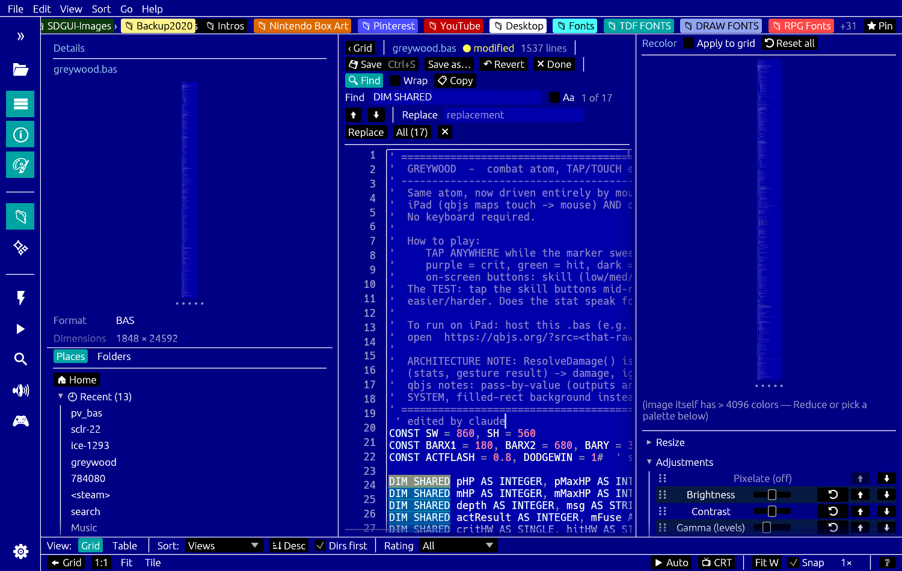

**Editing is opt-in.** The `✎ Edit` button enables it, GitHub-style. Until you press
it, nothing you type can change a file — a browser that silently overwrites your
source is a different kind of program, and *falling into* that by pressing keys in a
viewer would be the worst version of it.

| | |
|---|---|
| `✎ Edit` | make the document editable |
| `💾 Save` / `Ctrl+S` | write it back |
| `Save as…` | write elsewhere, and follow the document there |
| `↶ Revert` | discard everything since open/last save |
| `● modified` | shown whenever the buffer differs from disk |

A native confirm guards **every** exit that would discard unsaved work — the back
button, `Esc`, and opening any other file.

Saving is refused for a file inside an **archive** or a **16colors/YouTube download**:
those paths point at a temp copy that gets thrown away, so the save would appear to
work and quietly lose your edit. Use *Save as…* to write somewhere real.

**Line endings round-trip.** The buffer is normalised to LF internally so the layout,
the cursor and search offsets all agree; saving restores the file's own endings, so a
CRLF file comes back byte-identical apart from your edit.

**Find & replace** (`Ctrl+F`) highlights every match inline — as part of the text
layout, so highlighting survives scrolling and wrapping — with the current match
tinted differently, and `Enter` / `Shift+Enter` to walk them. Replace appears only in
edit mode.

**Follow (`tail -f`)** re-reads the file as it grows and stays pinned to the end.

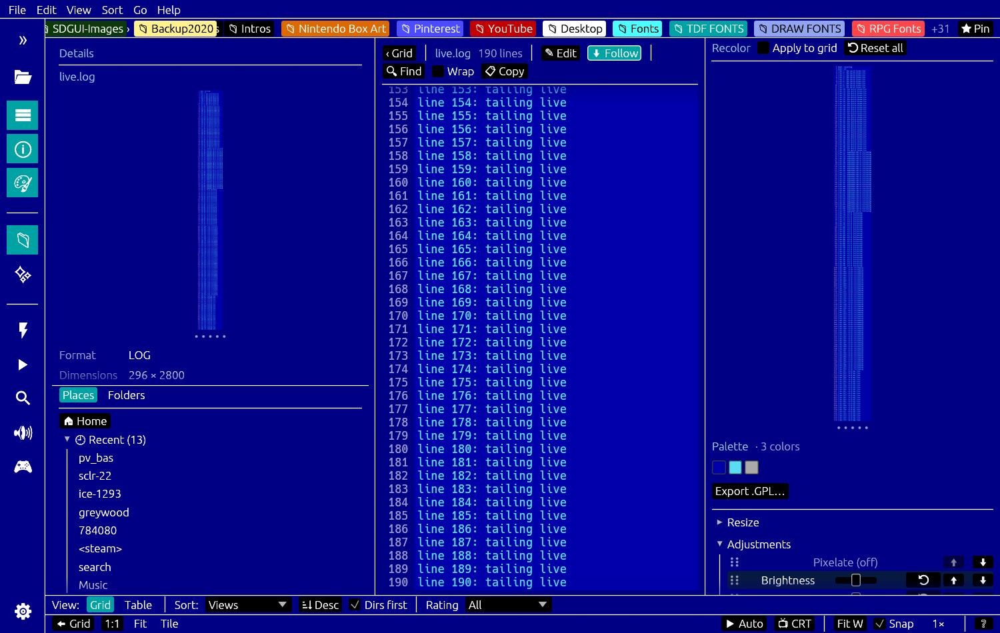

---

### 3D models

*Plugin — off by default.* `.obj` `.stl` `.ply` `.gltf` `.glb` `.dae`, plus `.mtl`
material swatches and `.blend` previews.


Grid thumbnails are real renders, and opening a model enters an interactive viewer.

The renderer is a **z-buffered CPU rasterizer**, not the GPU. That isn't a compromise
— the thumbnailer runs on worker threads with no GPU context, and using one renderer
for both the tile and the viewport means they can never disagree.

- **Orbit** (default) — drag to rotate, wheel to zoom, `Space`+drag to pan, `W`/`S` dolly
- **Right-click** toggles **FPS free-fly** (Blender walk-mode) — mouse looks, `WASD`
  moves, `Q`/`E` down/up. Entering seeds the camera from the orbit view so nothing
  jumps; leaving carries the pose back
- `Textured` and `Wireframe` are independent — wireframe is a depth-tested overlay, so
  it composes with either shading mode
- **Scene…** menu with named light presets (Studio / Product / Top / Rim / Dramatic…)
- **⬇ PNG** exports the current view at viewport size with a transparent background

`.blend` files can't be parsed — no Rust crate reads modern Blender 4.x — so
right-click → **🎬 Render with Blender** shells out to `blender -b` and *caches the
result as that file's thumbnail*, across restarts.

---

### Video

*Plugin — off by default. Needs `ffmpeg` / `ffprobe` on PATH.*

`.mp4` `.mkv` `.webm` `.mov` `.avi` `.wmv` `.flv` `.mpg` `.ts` `.ogv` `.3gp` and more.
Thumbnails are a real frame (grabbed 10% in, to skip black intros); opening one enters
a player with proper A/V sync — frames chase the audio clock, so it stays in sync on a
slow machine rather than drifting.

- **Transport** — play/pause (`Space`), a seek bar, speed 0.25×–4×, frame counter, and
  a `m:ss` "go to" field
- **Scrubbing plays audio** while you drag the playhead, DAW-style, even when paused
- **Hover-scrub thumbnails** — hovering a video tile in the grid extracts a strip of
  frames and maps pointer-x to a frame, YouTube-storyboard style
- **Lossless trim** — `i` / `o` set in/out, then *Export clip…* stream-copies the range
- **Lossless join** — select several clips → right-click → *Join N videos*
- **Chapter markers in a `.md` sidecar** — `clip.mp4` → `clip.md`. Timecode lines
  (`0:00 Intro`) become markers with notes beneath them; press `m` to drop one at the
  playhead. The file is YouTube-chapter-compatible, so logging footage and writing the
  description are the same action
- **Extract audio** to a file, or straight into the built-in sampler

---

### Image compare

Right-click any file → **Compare ▸ Set as source / Set as diff**. Setting both opens a
two-pane comparison that overlays per-pixel differences in a colour you pick.

- Independent **or synced** pan/zoom
- **Tolerance** and overlay **opacity** sliders, a differing-pixel readout, side swap
- **Layered PSD export** — the base image plus an opaque diff-colour layer whose *layer
  opacity* is the slider, so the blend stays editable in Photoshop or GIMP rather than
  being baked into pixels
- **Save/recall named comparisons**

---

### Mind maps (XMind)

`.xmind` files render as real mind maps — the archive is unzipped, `content.json`
parsed, laid out with a tidy-tree algorithm, emitted as SVG and rasterized.

It reads **the file's own theme**, so a map looks like it does in XMind: branch
palettes, filled or outlined topics, tapered ribbon connectors. Markers (priority,
task, flag, star), notes, labels, embedded images, boundaries, relationship arrows and
detached/floating topics all render. Multi-sheet files get a sheet selector, and
`←`/`→` turn sheets.

Because it's vector, zooming **re-renders from source** rather than magnifying a
bitmap — the same treatment PDF pages get.

---

### Fonts & type

`.ttf` `.otf` `.ttc` `.otc` and TheDraw `.tdf` files are first-class: a font's tile is a
rendered sample, and opening one gives a **type specimen** view with a glyph browser and
an editable sample string.

- **Colour fonts** (COLR/CPAL — emoji fonts and layered colour typefaces) render in
  their real colours, not as flat outlines
- **TheDraw `.tdf`** — the ANSI scene's block-letter fonts, all three flavours (outline,
  single-colour, multi-colour), rendered with the authentic CP437 cell
- **A logo maker** turns any TTF into art: ink / background / stroke colours, and a **3D
  extrusion** mode that builds a real mesh (caps, walls, bevel) and renders it through
  the same 3D pipeline as a model — exportable as PNG or as **vector SVG**

### AI generation *(plugin)*

An optional tab that shells out to a local generator, with results landing straight in
the grid where the ratings, palette tools and recolor pipeline already are. Off by
default; it's the one source that expects something set up on your machine.

### Git status

In a git repository, files are annotated with their status — a grid corner badge, a
table column, a Details line, and a filename tint (new = green, modified = orange,
conflict = red, ignored = grey).

It shells out to `git status --porcelain` once per folder, off the UI thread, so a
large monorepo can't stall navigation. Outside a repo — or with no `git` — it's
completely inert. Toggleable in Preferences.

---

## The interface

### Activity rail & docks


A VS Code-style **activity rail** down the left edge: sections (Files, Sources, Audio,
FX, AI) plus one button per enabled web source, and ⚙ Settings pinned at the bottom.
`»` expands it to show labels beside the icons; the icon size is configurable.

- **Docks** — an explorer (folder tree + filter), a live details pane, and the recolor
  pane, each toggleable
- **Layouts are remembered per view mode** — the panels you want while browsing a grid
  aren't the ones you want in the viewer, so each mode keeps its own arrangement
- **Recents** in the Places dock, storing the *display* path so an entry inside an
  archive or a downloaded pack survives a restart
- **Toast notifications** for background work (downloads, saves, renders)
- Left-clicking ⚙ opens a menu straight to the config files

### Command palette & quick open

| | |
|---|---|
| `Ctrl+Shift+P` | **command palette** — every menu action, searchable |
| `Ctrl+P` | **quick open** — jump to a file in the current folder by name |

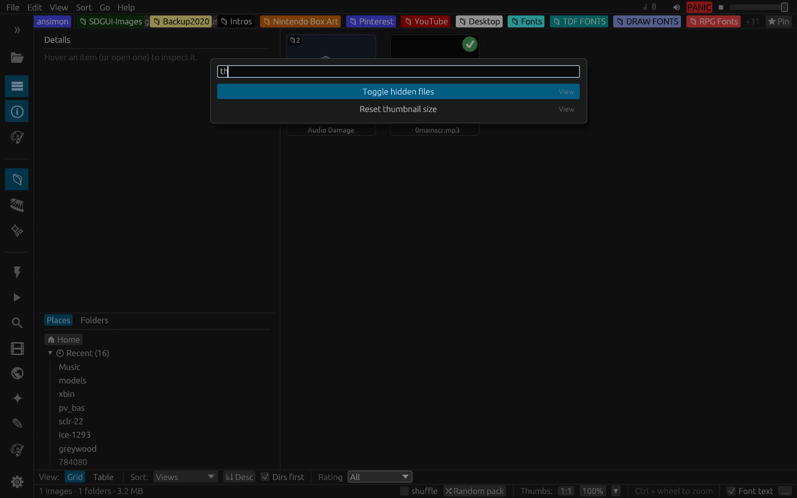

### Themes (and VS Code theme import)

Themes are `~/.local/share/kaleidotron/themes/*.json`. **Drop a VS Code theme in that
folder and it's imported directly** — `colors` become the app chrome, `tokenColors`
become syntax highlighting.


A **scope** switch decides how far a theme reaches: *Everything*, *Code only* (syntax,
app keeps its built-in look), or *App only*.

Syntax theming resolves a theme's **own language scopes**, not just generic ones. This
matters more than it sounds: a theme written for QB64PE colours a statement
`keyword.all.QB64PE`, and asking only for the generic `keyword` finds whatever base
rule the theme inherited — often nearly identical to its identifier colour, so the file
renders almost monochrome and the theme looks like it never loaded.

The **grid thumbnail is themed too**, so a source file's tile matches the viewer.

### Configuration files

Four text files, all tolerant of `//` comments, seeded on first run, and never fatal if
you break one.

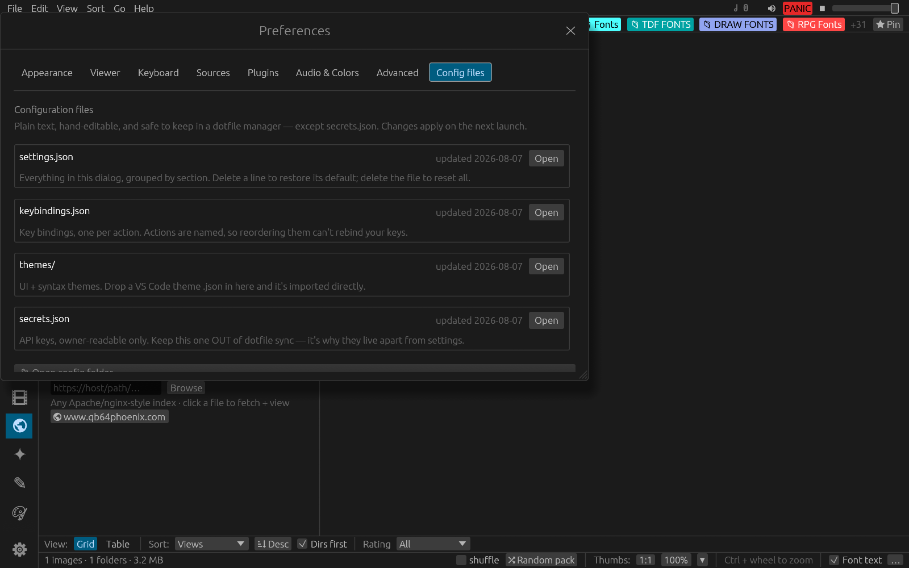

| file | holds |
|---|---|
| `settings.json` | ~45 curated settings, one object per section |
| `keybindings.json` | actions keyed by name |
| `themes/*.json` | app + syntax themes, including imported VS Code ones |
| `secrets.json` | API keys — `0600`, and deliberately **not** in `settings.json` so that file stays safe to sync |

Preferences has a **Config files** tab listing each with its last-modified time and a
button to open it.

`settings.json` is written **atomically**, and a file that exists but can't be read is
copied aside rather than replaced — losing hand-written settings to a half-written file
is not an acceptable failure mode.

**Export / import your whole setup** (Preferences → **Advanced → Backup & sync setup**):
one button writes every setting *plus* your keybindings to a single portable JSON file, and
another imports it — applied live, no restart. **API keys are excluded by default**; an
opt-in checkbox includes them, guarded by a plain-text warning (anyone the file reaches — a
share, a cloud/dotfile/backup copy — can read them). The bundle is plain JSON, and `.ron` /
`.json` open right in the built-in text viewer (syntax-highlighted) for inspection.

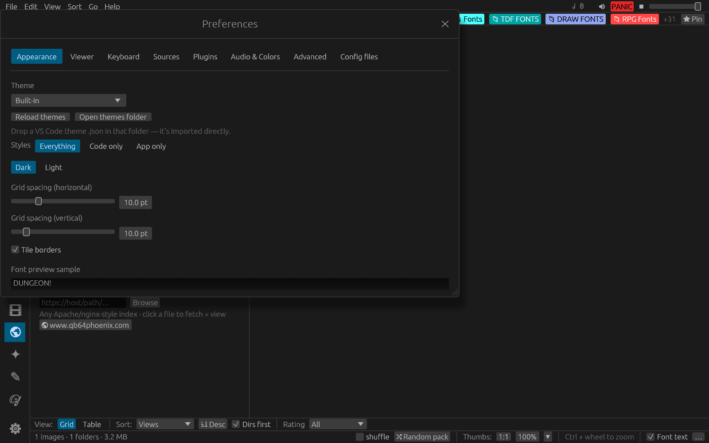

---

## Web sources

**Every** source — including **16colo.rs**, **YouTube** and **Steam** — is an
**off-by-default toggle** in **Preferences → Sources**; switch on the ones you browse and
each appears as a button in the rail. All are **keyless** except where noted — no account,
no API token.

| source | what you get |
|---|---|
| **[16colo.rs](https://16colo.rs)** | the ANSI archive as a virtual folder — years, packs, groups, artists, search; bulk-download an artist or pack for offline use |
| **[Poly Haven](https://polyhaven.com)** | CC0 3D models, textures and HDRIs. Models arrive as bundles (glTF + `.bin` + textures) and are materialised so they just open |
| **[Google Fonts](https://fonts.google.com)** | browse the whole library — each tile renders a live sample of the actual font; open one to download the `.ttf` into the font viewer |
| **[Lospec Palettes](https://lospec.com/palette-list)** | palette browser — **tag search across the whole list**, a tag cloud built from results, colour-count + sorting filters, and a detail view (author, colours, downloads) |
| **[Lospec Gallery](https://lospec.com/gallery)** | browse the art gallery with the site's own filters — **medium** (pixel / voxel / low-poly / textmode), **category**, **sorting**, **time**, **tag**, and monthly-**masterpiece**-only |
| **[The Mod Archive](https://modarchive.org)** | tracker modules, playable in place |
| **[Openverse](https://openverse.org)** | CC-licensed images, audio and animated GIFs |
| **[Iconify](https://iconify.design)** | icon search across many sets |
| **Wikimedia** | vector/SVG art search |
| **[DeviantArt](https://www.deviantart.com)** | browse via the official API — Daily Deviations, Home, Tag search, Topic; full-size view + link-back; **needs free app credentials** (below) |
| **HTTP browser** | point it at *any* URL and browse it like a folder tree |

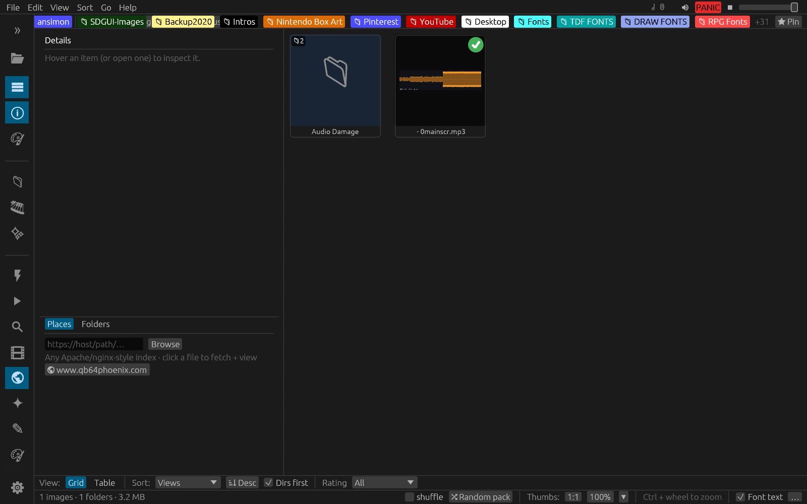

The **HTTP browser** doesn't need an Apache/nginx autoindex — it introspects the
rendered page, extracts links with their names, and lets you **select by wildcard** and
**batch download**, including recursively. Total Commander's FS plugins, roughly.

**YouTube** (needs `yt-dlp`) searches and plays videos by downloading them in place;
once downloaded a video is an ordinary local file, so markers, trim, join and frame
export all apply. Downloads go to a configurable folder kept **out** of the HTTP cache.

**Steam** reads your local Steam library — no API key, no login — lists installed games
as tiles, and routes a click to a YouTube search for that game. Right-click to launch
the game, or open its store page, hub or discussions.

**DeviantArt** is the one source that needs credentials — DeviantArt's API requires
them even for public browsing. Register a **free** app at
[deviantart.com/developers](https://www.deviantart.com/developers) (client type
*Confidential*; the redirect URI is unused by this app — any valid URL works), then paste
the **client_id** + **client_secret** into **Preferences → Plugins**. kaleidotron mints a
short-lived app token itself (the client-credentials flow — no user login, no OAuth
redirect dance), so once the two values are in, **Browse** with *Daily Deviations* works
with no query. Tag and Topic search by name; opening a piece shows the full-size image and
links back to the artist's page. The credentials live in `secrets.json` and are **excluded
from setup export by default**.

### Being a good citizen

Every web source goes through one HTTP choke point that honours **robots.txt**
(RFC 9309, including `Crawl-delay`), rate-limits per host, backs off on `Retry-After`,
sends an honest User-Agent, and caches aggressively — a 2 GiB on-disk cache with LRU
eviction, so re-browsing costs nothing. The bulk downloader is **cache-first**: anything
you've already viewed is copied locally without a request.

---

## Keyboard shortcuts

The four **navigation keys are rebindable** in **Preferences → Hotkeys** (press
*Rebind*, then the new key; `Esc` cancels). Their defaults:

| Key | Action | Where |
|---|---|---|
| `←` | Previous image | Viewer |
| `→` | Next image | Viewer |
| `Esc` | Back to grid | Viewer |
| `Backspace` | Parent folder | Anywhere |

The rest are fixed (this is the same list shown in **Help → Keyboard shortcuts**):

| Key | Action |
|---|---|
| `Ctrl +` / `Ctrl -` | Zoom the whole UI |
| `Ctrl + Wheel` / pinch | Resize thumbnails (grid) · zoom image (viewer) |
| `Wheel` | Viewer: previous / next image (or scroll a long one) · Grid: scroll |
| `↑` / `↓` | Viewer: scroll a long image |
| Mouse Back / Fwd | Grid: folder history · Viewer: prev / next image |
| `Home` / `End` | Grid: first / last · Viewer: scroll to top / bottom |
| `PageUp` / `PageDown` | Viewer: scroll 25 lines (a screen of scene art) |
| `/` | Grid: filter by filename |
| `Ctrl + F` | Advanced recursive search · **in the text view: find/replace** |
| `Ctrl + P` | Quick open — jump to a file by name |
| `Ctrl + Shift + P` | Command palette — every action, searchable |
| `Ctrl + S` | Save (text view, while editing) |
| `Drag` | Pan the image (viewer) |
| `F` | Fit to window + auto-fit new images (viewer) |
| `T` | Grid/Table toggle (browse) · Tile preview — fill window (viewer) |
| `F11` | Immersive / fullscreen |
| `1` – `5` | Set star rating |
| `0` | Clear rating |
| `R` | Jump to a random 16colo.rs pack |
| `Enter` | Open the current file in its OS default app |
| `Space` | Play / pause audio · video playback |
| `i` / `o` | Video: set trim in / out |
| `m` | Video: drop a chapter marker at the playhead |
| `Shift + Esc` | PANIC — stop all sound immediately |
| Right-click | 3D viewer: toggle FPS free-fly |
| `Click` | Open image / enter folder |
| `Ctrl + Click` | Toggle selection |
| `Shift + Click` | Range-select |
| `Right-click` | Grid: file-operations menu |
| `Ctrl + C` / `X` / `V` | Copy / Cut / Paste |
| `Ctrl + N` | New folder |
| `F2` | Rename |
| `Delete` | Move to trash |
| `Ctrl + Z` | Undo last file operation |

**Zoom chord (viewer):** hold **`Z`** and press a digit to jump to an exact zoom —
`1`–`9` = 100%–900%, `0` = 1000%. For textmode/scene art the digit means **device
pixels per source pixel** (e.g. `Z`+`3` = `3×`). `Z` + `+`/`=` and `Z` + `-` step the
zoom ladder. (Holding `Z` suppresses the `1`–`5` rating keys.)

---

## Command-line options

```
kaleidotron — a pixel-art-first media browser

USAGE:
    kaleidotron [OPTIONS]
    kaleidotron --render <PATH>... [RENDER OPTIONS]   (headless; no window)

OPTIONS:
    -f, --folder <PATH>           Open this folder on launch
    -t, --thumbnail-size <SIZE>   Thumbnail tile size: a number (e.g. 160) or
                                  WxH (e.g. 120x160 — tiles are square, so the
                                  larger dimension is used)
    -h, --help                    Print this help

PROFILE OPTIONS (test a build from a clean slate; settings live in the data dir):
        --data-dir <DIR>          Use DIR for ALL settings / cache / ratings instead of
                                  the default (~/.local/share/kaleidotron). Non-destructive
                                  and repeatable — point it at an empty dir for a fresh run.
        --reset                   Back the current profile up to '<data-dir>.bak' (once — your
                                  real settings are never clobbered) and start FRESH.
        --restore                 Move '<data-dir>.bak' back over the current profile, then exit.

RENDER OPTIONS (convert text art — ANS/XB/XBIN/RIP/… — and images to files):
    -r, --render <PATH>...        One or more input files and/or folders. A folder
                                  converts every viewable art file inside it. Inputs
                                  must follow --render together (before other flags).
    -o, --out <FILE>              Output file (only with a single input file).
        --outdir <DIR>            Output folder for batch conversion (created if needed).
                                  Default: each file is written beside its input.
        --font-9px                Render the 9-dot VGA text cell (line-draw chars join),
                                  the way real VGA / ansilove / 16colors do. Default: 8-dot.
        --scale <N>               Nearest-neighbor upscale the output N× (default 1).
        --format <FMT>            Force the output encoder (png, bmp, tga, …) instead of
                                  inferring it from the output filename's extension.
```

`--thumb-size` is accepted as an alias of `--thumbnail-size`. **Settings passed on
the command line override the persisted ones and are remembered afterward.**

### Rendering text art to files (`--render`)

`--render` turns any format kaleidotron can decode — **ANSI, XBin, RIPscript, raw BIN,
iCE Draw, Artworx, TundraDraw, PETSCII, …** and ordinary images — straight into a PNG
(or BMP/TGA/…) **with no window**, so it works over SSH and in batch scripts. The output
is pixel-identical to what the viewer shows: text-mode art is rasterized with the real
IBM VGA / C64 fonts, SAUCE-aware, in true 24-bit color.

```sh
# One ANSI file → PNG written beside it (ART.png)
kaleidotron --render ART.ANS

# ANSI → an explicit output path
kaleidotron --render ART.ANS -o ~/renders/art.png

# XBin, using the authentic 9-dot VGA cell (matches ansilove / 16colors widths)
kaleidotron --render SCENE.XB --font-9px -o scene.png

# RIPscript (EGA vector) → PNG
kaleidotron --render LOGO.RIP -o logo.png

# The other binary scene formats, one per line:
kaleidotron --render ART.BIN -o art.png     # raw BIN (SAUCE width)
kaleidotron --render ART.IDF -o art.png     # iCE Draw
kaleidotron --render ART.ADF -o art.png     # Artworx
kaleidotron --render ART.TND -o art.png     # TundraDraw (24-bit truecolor)
kaleidotron --render ART.SEQ -o art.png     # Commodore PETSCII (.seq / .pet)

# 2× nearest-neighbor upscale, encoded as BMP
kaleidotron --render ART.ANS --scale 2 --format bmp -o art.bmp

# Batch — convert a whole pack folder into an output folder
kaleidotron --render ~/packs/blocktronics/ --outdir ~/renders/

# Batch — several named files at once, all 9-dot, into one folder
kaleidotron --render a.ans b.xb c.rip --outdir out/ --font-9px
```

**Behavior & rules**

- Each input is either a **file** (converted directly, whatever its type) or a **folder**
  (scanned non-recursively; every scene/raster art file inside is converted — audio, PDF
  and source-code files are skipped).
- `-o/--out` maps **one input file → one output file**. For multiple inputs or a folder,
  use `--outdir` (each file is written as `<name>.<fmt>`); with neither, output lands
  **beside each input**.
- Format is inferred from the output extension; `--format` forces it (handy with `--outdir`,
  e.g. `--format tga`).
- Exit code: **0** = all rendered, **1** = one or more failed / nothing found, **2** = bad
  usage (e.g. `-o` with a batch, or an unknown `--format`).

---

## Menu reference

| Menu | Items |
|---|---|
| **File** | Open folder… · Quit |
| **Edit** | ↩ Undo · Copy · Cut · Paste · New folder · Rename… · Move to trash · Find images… (Ctrl+F) |
| **View** | Table view · Explorer pane · Details pane · Recolor pane · Reset thumbnail size · Associations… · Preferences… |
| **Sort** | Name · Type · Modified · Created · Size · Rating · Colors · Descending · Directories first |
| **Go** | ⬆ Up · 🏠 Home · *(your pinned favorites)* |
| **Help** | Keyboard shortcuts |

**Preferences** covers theme (Dark/Light), grid spacing, caption fields, table columns,
the default textmode zoom, the metadata-OSD position/hold, the rebindable **Hotkeys**,
the **Format plugins** toggles (source code / PDF / audio), the palette directory, and the
16colo.rs cache (size + Clear).

---

## Settings & where things are stored

Everything lives under `~/.local/share/kaleidotron/` on Linux.

- **Settings** persist via eframe's storage — every setting (zoom, thumbnail size,
  favorites, last folder, sort/filter, dock visibility, grid spacing, captions, keymap,
  CRT/baud/look toggles, …) is its own key. The ~45 most useful of them are also exposed
  as editable text in **`settings.json`**, alongside **`keybindings.json`**,
  **`themes/*.json`** and **`secrets.json`** — see [Configuration files](#configuration-files).
- **Kits and pads** — the sample-pad working set is `pads/*.wav`, and saved kits are
  `kits/*.pvkit` (a zip of the samples plus a manifest).
- **Ratings** live in two places: the `user.baloo.rating` xattr on real files (for
  Gwenview interop) and a portable `ratings.json` sidecar in the data dir (for
  virtual art and non-Linux platforms).
- **View history** is a small SQLite database (`views.db`) in the data dir — visited
  state, view count, and first/last-viewed, keyed by the same stable display path.
- **The HTTP cache** (16colo.rs and every other web source) lives under `<data>/cache/`
  — blob files plus a `cache.db` index, capped at 2 GiB with LRU eviction. Clear it from
  Preferences.
- **YouTube downloads** go to `<data>/youtube` by default, deliberately *outside* the
  capped cache since videos are large. Point it elsewhere in Preferences.

### Upgrading from pixelview

kaleidotron was called **pixelview** until August 2026. On first run it copies an old
`~/.local/share/pixelview` across automatically — ratings, view history, kits, pads,
themes and settings — and **leaves the original completely untouched** as a backup you
can delete once you're happy.

The `cache/` and `youtube/` directories are *linked* rather than copied: they're the only
large things there (gigabytes), and duplicating data that is either regenerable or already
on disk once would just stall startup.
- **Palettes** are embedded in the binary; an optional user palette directory adds
  more `.GPL` files on top.

---

## Bundled palettes

55 `.GPL` palettes ship inside the binary (color count in parentheses):

```
1BIT (2)                 EGA (16)                 NES (55)
2BIT (4)                 ENDESGA-16 (16)          PICO-8 (16)
6BIT (64)                ENDESGA-32 (32)          PICO-8-SECRET (32)
AMSTRADCPC (26)          ENDESGA-36 (36)          PINEAPPLE-32 (32)
ANSI32 (32)              ENDESGA-64 (64)          QUAKE (244)
APPLE2-HIRES (6)         FAIRCHILD (8)            SECAM (8)
APPLE2-LORES (16)        FUNKYFUTURE (8)          SEGA (64)
ATARI-8BIT (256)         GAMEBOY (4)              SHOVEL-KNIGHT-NES (59)
ATARI2600 (128)          GAMEBOY-BGB (4)          SODA-CAP (4)
BBCMICRO (16)            HALLOWPUMPKIN (4)        SYNTHEWAVE-CITY (8)
BLOODMOON21 (9)          INK (5)                  TELETEXT (8)
C=64 (16)                INK-CRIMSON (10)         VGA (256)
CGA0/1/2-HIGH/LOW (4)    INTELLIVISION (16)       VINES-FLEXIBLE-LINEAR-RAMPS (38)
CGA32 (32)               JUNGLE-8 (8)             VIVIDMEMORY (8)
COLODORE (16)            MS-WINDOWS (16)          ZXSPECTRUM (16)
CYBERPUNK-NEONS (11)     MSX (16)
DAWNBRINGER-16 (16)
DAWNBRINGER-32 (32)
DAWNBRINGERS-8-COLOR (8)
```

Drop a `.GPL` into `assets/palettes/` (and add one `include_str!` line) to bundle a
new one, or point kaleidotron at a palette directory to load yours at runtime.

---

## Architecture

A single binary crate (`kaleidotron`). Three subsystems wired together at startup:

1. **Decoder registry** (`src/decode/`) — a `Vec<Box<dyn Decoder>>` with two-tier
   dispatch: every decoder's `sniff()` (magic bytes) is tried first, then file
   extension as a fallback. Adding a format is one new file + one `Box::new(...)`
   line.
2. **Threaded thumbnailer** (`src/thumb.rs`) — a worker pool (one thread per core)
   sharing a LIFO job stack so just-scrolled tiles decode first. Only CPU RGBA
   buffers cross back to the UI thread; texture upload happens there.
3. **The UI** (`src/app.rs`) — `Kaleidotron`, an `eframe::App`: a stack of panels
   (menubar, rail, favorites, breadcrumbs, search, docks, status/sort bars) around a
   central grid-or-viewer.

```
src/
  main.rs            eframe entry / window setup
  app.rs             Kaleidotron: the whole UI, model, settings, sort/filter, ratings, CLI
  image_types.rs     PixImage (RGBA + optional indexed/palette)
  thumb.rs           worker pool: thumbnails + metadata
  rating.rs          star ratings via the user.baloo.rating xattr
  ratings.rs         cross-platform ratings.json sidecar
  viewdb.rs          SQLite view-history store (visited / count / last-viewed)
  anim.rs            animated-GIF frame decode
  git.rs             per-folder git status (shells out to git status --porcelain)
  video.rs           interactive video player: ffmpeg frame pipe + rodio audio + A/V clock
  scale.rs           pixel-art upscalers (Scale2x/3x, Eagle, xBR, HQx, 2xSaI…)
  sauce.rs           SAUCE record + COMNT-comment parsing
  decode/            Decoder trait + every format decoder
  palettes_builtin.rs  the embedded .GPL library

  # configuration
  settings.rs        settings.json — curated, sectioned, atomically written
  keybindings.rs     keybindings.json (+ the shared JSONC comment/trailing-comma cleaner)
  theme.rs           themes/*.json, including VS Code theme import
  secrets.rs         secrets.json — API keys, 0600, kept out of the shared settings

  # web sources (each keyless; all share cache.rs + netpolicy.rs)
  netpolicy.rs       robots.txt, per-host rate limiting, backoff — the single choke point
  cache.rs           persistent SQLite-indexed HTTP cache (2 GiB, LRU)
  sixteen.rs         16colo.rs JSON API (years/packs/artists/groups/search)
  colo_thumb.rs      worker pool fetching remote thumbnails
  polyhaven.rs       Poly Haven CC0 models / textures / HDRIs
  gfonts.rs          Google Fonts
  lospec.rs          Lospec palettes
  modarchive.rs      The Mod Archive (tracker modules)
  audiosearch.rs     Openverse audio / images / GIFs
  httpfs.rs          browse any URL as a folder tree (page introspection)
  youtube.rs         yt-dlp search + download
  steam.rs           local Steam library → YouTube bridge
```

For the deep internals — the recolor pipeline, the pixel-perfect blit math, the RIP
BGI rasterizer, the baud-playback engine, SAUCE handling, and the egui version
gotchas — see [`CLAUDE.md`](CLAUDE.md).

---

## Development

```sh
cargo run --release      # build + launch
cargo check              # fast type-check
cargo clippy             # lint
cargo fmt                # format
cargo test               # 233 tests (unit + headless egui_kittest GUI tests)
cargo test gui_tests     # just the GUI tests
```

Pinned to `eframe = "0.34"` / `image = "0.25"` (with `Cargo.lock` committed). egui
renames symbols even between patch releases — if a build breaks on an egui symbol,
it almost certainly just moved; check the egui CHANGELOG for that version.

### CI & releases

Two GitHub Actions workflows live in `.github/workflows/`:

- **`ci.yml`** — builds + runs the headless test suite on Linux for every push/PR (plus a
  best-effort GUI-screenshot artifact).
- **`release.yml`** — builds standalone binaries for **Linux x86-64**, **Windows x86-64**,
  and **macOS arm64** (Apple Silicon). Run it manually (Actions → *Release* → *Run
  workflow*) to get the archives as downloadable workflow artifacts, or **push a version
  tag** to build them *and* publish a GitHub Release:

  ```sh
  git tag v0.1.0 && git push origin v0.1.0
  ```

  Each archive contains the binary + `README.md`; the Windows `.zip` also ships `pdfium.dll`
  (keep it next to `kaleidotron.exe` — it's what renders PDFs in-process). The macOS builds
  are **unsigned**, so first launch needs a right-click → *Open* (or `xattr -dr
  com.apple.quarantine kaleidotron`) to get past Gatekeeper.

> **Note on UI glyphs:** the bundled egui font lacks the Geometric Shapes block
> (`▲`/`▼`/`●` render as tofu). Stick to the emoji arrows `⬅`/`➡`/`⬆`/`⬇`,
> `⟲`/`⟳`, `…`/`×`/`›`/`★`/`📁`/`·`, or ASCII — or paint the glyph yourself.

---

## Credits

- [egui / eframe](https://github.com/emilk/egui) — the immediate-mode GUI.
- [`image`](https://github.com/image-rs/image) — the raster decoders.
- [resvg](https://github.com/RazrFalcon/resvg) — SVG rasterization.
- Mike Krüger's **icy ecosystem** ([`icy_tools`](https://github.com/mkrueger/icy_tools)) —
  `icy_parser_core` powers the PETSCII and RIPscript parsers (driven into kaleidotron's
  own renderers), and `unarc-rs` handles archive extraction. The RIP BGI primitives
  are ported pixel-for-pixel from `icy_engine`'s reference renderer.
- The bundled **CP437 VGA font** derives from the IBM ROM (the canonical block/shade
  dithers); the **C64 font** is from the MEGA65 open-roms project (LGPL).
- The `.GPL` palette library draws on the work of DawnBringer, Endesga, PICO-8, and
  the broader pixel-art community.
- Star ratings use the **KDE Baloo** `user.baloo.rating` scheme for Gwenview
  interoperability.

## License

Released under the **MIT License**.

> Note: the bundled fonts carry their own licenses — the C64 font is from the MEGA65
> open-roms project (LGPL) and the CP437 VGA font derives from an IBM ROM. The MIT
> license covers kaleidotron's own source, not those embedded assets.
