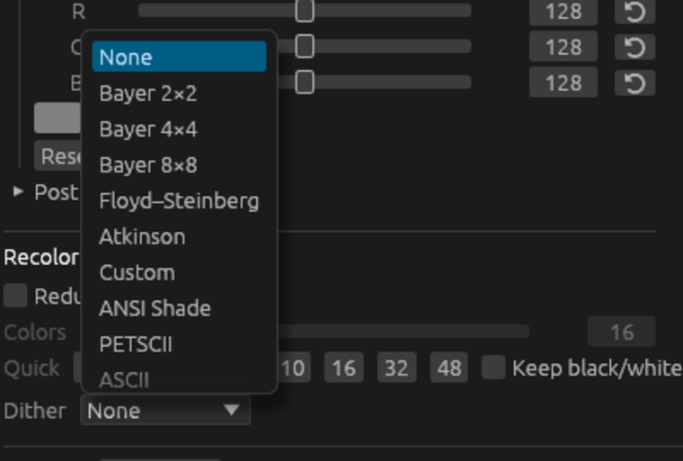
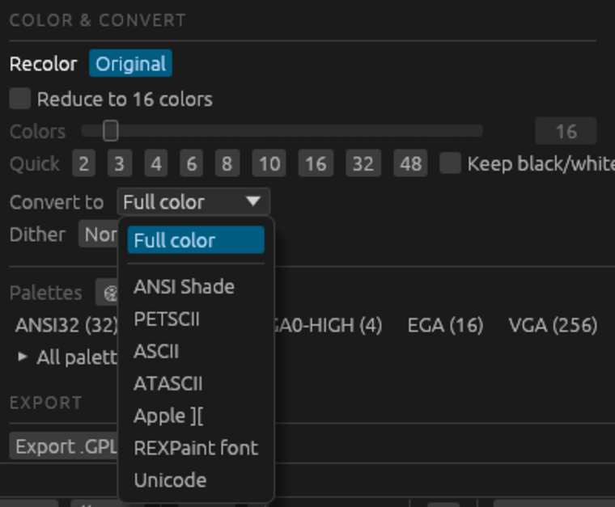
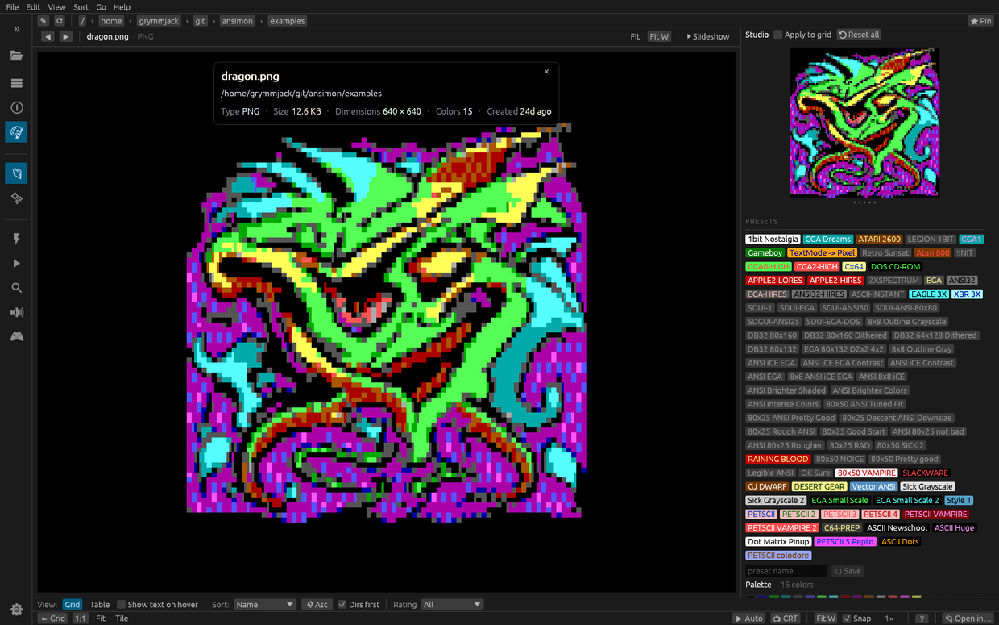
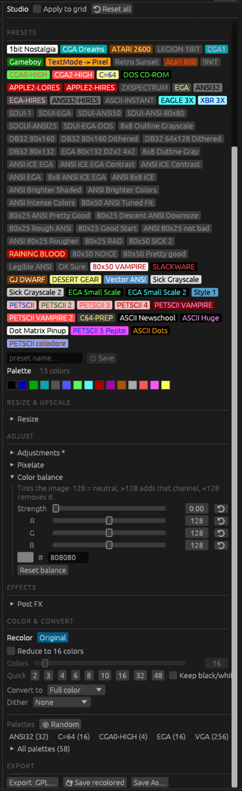
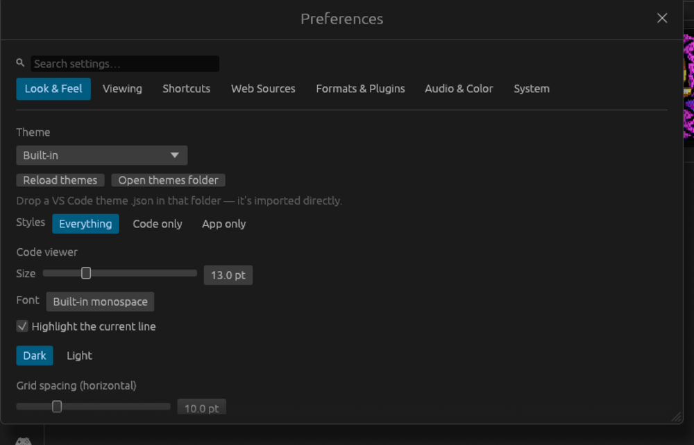

# redesign-1 — an intentional, coherent GUI

A branch-scoped UX pass turning the "dog's breakfast" of accreted controls into one
designed system. No features removed — this is information architecture + visual craft.
Every commit leaves the app compiling; each is independently revertable.

## What changed

**Studio pane (was "Recolor")** — the headline.
- The **Dither dropdown anti-pattern is gone.** It used to hide seven whole art
  *converters* (ANSI Shade / ASCII / PETSCII / ATASCII / Apple ][ / REXPaint / Unicode)
  inside a control named "Dither". Those are now a top-level **Convert to** selector (the
  output *mode*); **Dither** lists only real patterns (None / Bayer / Floyd–Steinberg /
  Atkinson / Custom) and hides while a converter is active. Same `dither_method` field —
  no pipeline change.
- **PixelFX presets moved to the top of the pane** (a chip strip + Save), so the fastest
  path to a look — CGA, Game Boy, EGA — is one click, not three tabs away in Places.
- The pane now reads **top-to-bottom in named bands**: Resize & Upscale → Adjust →
  Effects → Color & Convert → **Export** (Export pinned to the bottom where it belongs).
  Eight former peer accordions group into one hierarchy.

**Preferences** — honest and searchable.
- The eight grab-bag sections (incl. "Audio & Colors", "Advanced" — names that "reflected
  where things landed") became seven task-based tabs: Look & Feel · Viewing · Shortcuts ·
  Web Sources · Formats & Plugins · Audio & Color · System (Config-files editor folded in).
- A **search box** jumps to the best-matching section via a per-section keyword index.

**Contextual viewer toolbar** — controls where the eyes are.
- A slim, file-type-aware toolbar pinned above the art in single view: prev/next +
  filename on the left; Fit / (scene-art: 9px, CRT) / Slideshow on the right. Hidden for
  the special viewers (video/audio/3D/…) and in immersive mode.

**Discoverability.**
- The command palette gained **goal-shaped commands**: "Convert image to <mode>", "Apply
  preset: <name>", "Start slideshow", "Open kit editor" — type what you want.

**Shared visual language.**
- `panel_header` (spaced small-caps + hairline rule) + `spaced_caps` give the Studio and
  Details panes one section idiom, so the docks read as one designed system.

## Deliberate non-goals (kept safe on a branch)
- **Status-bar teardown deferred.** The bottom bar keeps its full `📺 CRT` menu; it lives
  in a fragile right-to-left layout and is asserted by GUI tests. The new toolbar is the
  quick path, the status bar the complete one.
- **`cargo fmt` NOT run.** It reformats the whole (non-fmt-clean) repo — 38 files — which
  would bury the redesign. New code matches the file's existing style by hand.
- A deeper move of the big Color & Convert block above Adjust is left as a future tweak
  (it's a ~1000-line nested scope; the band header makes its placement intentional for now).

## Verification
- `cargo check` green after every task; `cargo build --release` clean.
- `cargo test --release`: 456 pass, 43 ignored. The one failure,
  `clicking_a_favorite_navigates_to_it`, **fails identically on `main`** — a documented
  local env flake (dir-watcher vs the 4-step kittest harness), not a regression.
- Clippy: 2 pre-existing warnings (app.rs:138/155); my one type-complexity warning fixed.

## Screenshots (`docs/redesign/`)

Captured live from the running release binary on each branch.

**The Dither anti-pattern, before & after** — the same dropdown opened on each branch:

| `main` (before) | `redesign-1` (after) |
| --- | --- |
|  |  |
| One "Dither" combo mixing real dithers **and** whole converters (ANSI Shade / PETSCII / ASCII…). | **Convert to** = a clean mode list; **Dither** demoted beside it, patterns only. |

Both write the same `dither_method` field (converters 7–13 vs patterns 0–6 are disjoint),
so the split was pure UI — no pipeline change.

-  — the redesigned viewer: contextual
  toolbar above the art, Studio pane with the PixelFX preset strip.
-  — PRESETS → RESIZE & UPSCALE → ADJUST →
  EFFECTS → COLOR & CONVERT → EXPORT.
-  — task-based tabs + the search box.

See `.claude/TASKS.md` for the task-by-task log with commit SHAs.
