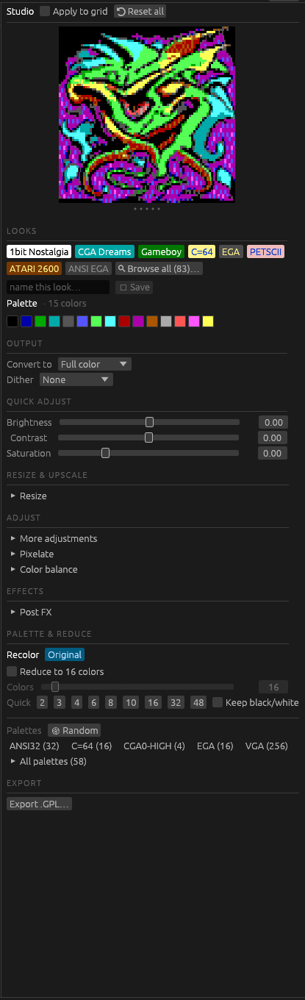

# redesign-2 — the Studio pane as a cockpit, not a warehouse

Rick's note on redesign-1: the spatial + interaction models were fine; what was wrong was
**cramming 58 presets on the right pane and dropping the most-used recolor controls behind a
scroll**. redesign-2 fixes exactly that: what you touch every recolor is always in front of
you; the rare knobs are one reach away.

Branch off redesign-1 (keeps the Convert/Dither split, Preferences work, viewer toolbar).

## The pane, top to bottom now

- **Looks** — a small gallery of *pinned* looks + **Browse all…**, not a wall of 58 chips.
  Pins persist (`look_pins`, seeded with a curated default set); right-click to unpin; saving
  a look auto-pins it. The full library lives in a searchable, folder-grouped **Look library**
  modal.
- **Output** — Convert to + Dither, the core recolor decisions, **always visible at the top**
  (they were buried at the bottom before). Converter-specific parameter panels stay lower.
- **Quick Adjust** — Brightness / Contrast / Saturation, always visible. The full 12-op stack
  + pipeline reorder moved behind a default-collapsed **More adjustments** reveal.
- **Reveals** (all collapsed by default) — Resize & Upscale · More adjustments · Pixelate ·
  Color balance · Post FX · Palette & Reduce.
- **Export** — pinned at the bottom.

The whole pane now fits on one screen without scrolling.

## Commits

| SHA | |
| --- | --- |
| C0 | Looks gallery replaces the 58-preset wall |
| C1 | lift Convert to + Dither into a top Output section |
| C2 | Quick Adjust trio up top, full stack collapsed |
| C3 | collapse rare reveals + rename lower band |
| Z1 | clippy cleanup |

`cargo test --release`: 456 pass; the lone failure (`clicking_a_favorite_navigates_to_it`)
also fails on main — a documented local env flake, not a regression.

## Deliberately NOT done yet (need your steer)

- **Live-look previews** — rendering the *current image* through each pinned look as its chip
  thumbnail (a filter-strip gallery). Buildable on the existing recolor-thumbnail path; left
  as a follow-up.
- **Visual identity** — you asked for "help with the rest." Committing to a signature look
  (accent, density, the whole chrome feeling like the scene it browses) is design-subjective
  and worth a conversation with the cockpit in front of us, rather than another unilateral pass.
